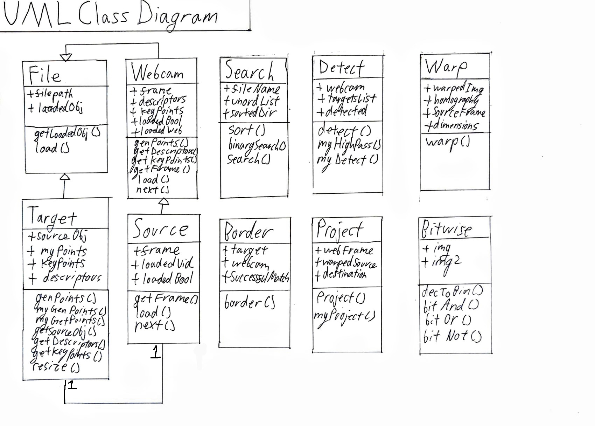
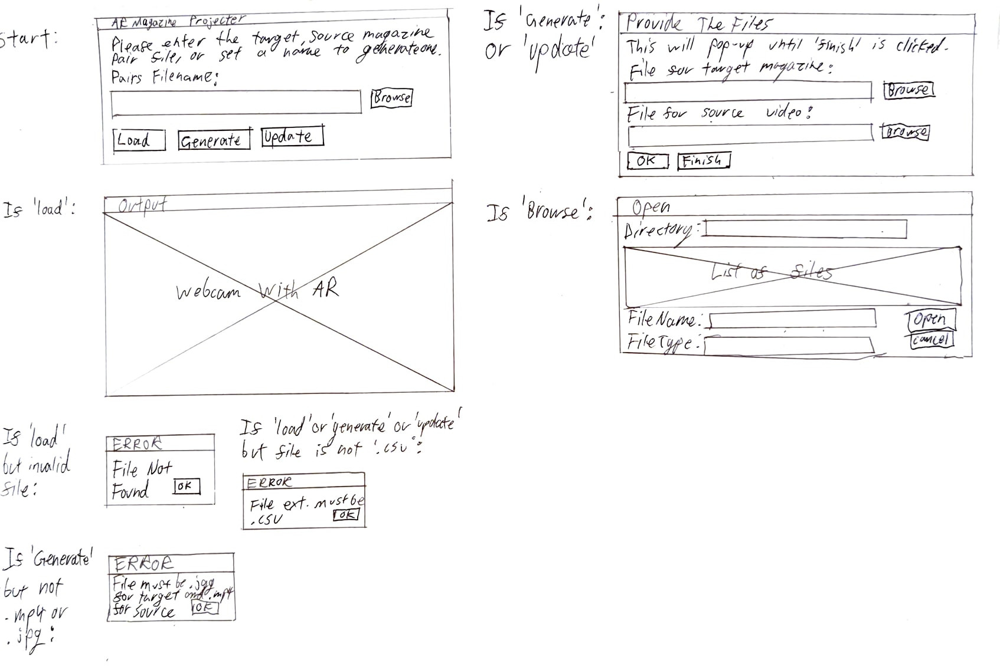
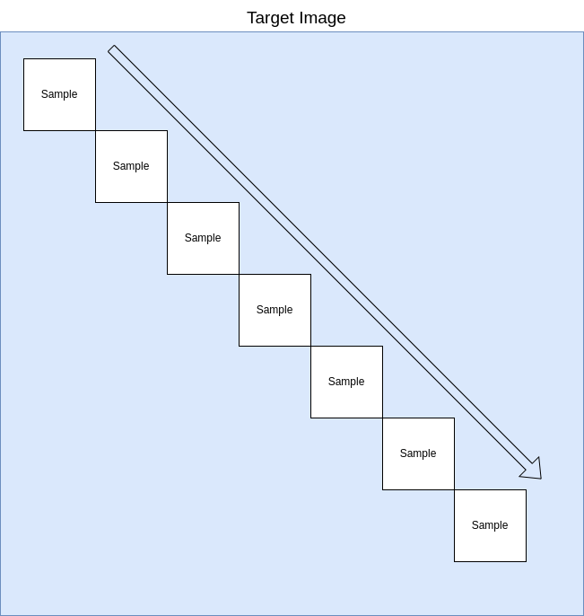

# Computer Science NEA - AR Video Magazine Covers
## Requirements:
 - Python 3.XX
 - Numpy
 - OpenCV (pip3 install opencv-python)
 - PySimpleGUI (pip3 install PySimpleGUI)

## Analysis:
### Introduction:
My project idea is to create either an investigation into, or a finalized app product which overlays a video of a pre-recorded magazine cover where the main image model is moving. This video is to be overlain on top of a printed magazine in real life (Augmented Reality). It should follow and adapt to the movements and angling that the camera is taking footage from.

### Who is the product for?
I want to create this product to help the school's Media Studies department, specifically Mr.Robson, create new, innovative interaction methods for student's GCSE, AS, and A level coursework. The coursework all involve creating either a magazine or a 'digipack' which also features a cover similar to a magazine. My product will allow them to deepen user imersion with their magazine or digipack while joining reality with digital. 

### Interview with Client:
#### What would you like the project to achieve?
INSERT ANSWER HERE
#### What are the key features of a program like this?
INSERT ANSWER HERE
#### Are there any additional features you would be interested in?
INSERT ANSWER HERE
#### What already exisiting AR or other related products interest you?
INSERT ANSWER HERE

### Main Objectives:
- Read video feeds from a webcam or smartphone camera
- Load source videos of pre-recorded moving covers 
- Detect and recognize which of the source videos matches to the magazine/digipack shown
- Detect edges and borders of the magazine/digipack
- Frame by frame overlay and adjust the warping of the source to match the one in the video
- Thereby creating an AR effect
- Finally adapt the project for a user friendly interface on laptops or a mobile application

### Already existing AR products:
#### Example 1: IKEA Place

Ikea Place is an app provided by the Swedish furniture company. It allows users who are browsing for furniture to place it inside of their home using their smartphone's camera. Allowing them to compare the size and aesthetic of the items. It also enourages users to create a more personal connection with the item being placed into their home via AR; making the app an effective sales technique. This relates to my project as it uses a projection in AR through a phone camera/webcam. It adjusts based on the movement of the camera. However my project does differ in some ways. Firstly, I would also have to adjust for when the camera is steady but the target (magazine) is moving. In IKEA Place, it's unlikely the target (floor or desk) would move instead of the camera. I also am using a different source. My AR is using a video feed whereas this uses a 3D model. The applications of my product are also different, being made for art and entertainment rather than commercial sales. 

#### Example 2: Snapchat filters

Snapchat filters are much more different to my project than Ikea Place. These AR filters track a users face to project things like masks, beards, tatoos and more onto them. It can be both 2D or 3D projections and they can respond to the users (for example some have physics implementations like to make wobbly noses when a persons head moves). I think the purpose of this product is more towards entertainment than Ikea Place, but much more so than my project. Snapchat filters are purely entertainment and novelty whereas AR magazine covers would be also informational. And of course theres the obvious difference in mine being non-3D model based.

#### Example 3: Pokemon GO

Pokemon Go is a 2016 mobile app which uses the iconic characters from Pokemon to make a location based video game. Users would have to physically move outside and the phone's GPS would register their location and move their character. Based on this they would encounter 'Pokemon' which they could try to 'capture'; capturing them is where AR and the link to my project arises as it would use the phones camera to AR project a 3D pokemon model. The user can also drag their finger across the screen to 'throw' a ball to catch them. My project doesn't involve this level of interactivity with the AR projection which could be something I need to consider implementing. 

#### Example 4: Google Maps Live View

Google in the past few years have rolled out a new feature in Google Maps on mobile. It's called 'Live View' and is used to allow you to see floating directional arrows and prompts for where to go if you're unsure in built-up areas with many alleys and possible routes. This stays tracked in position no matter where you point the smartphone as shown in the example image above. When first hearing of this idea it can feel somewhat gimmicky as holding up your phone in front of your face as a viewfinder for naviagtion could be distracting. However Google has developed the feature to use Google Street View data, another project where 360 cameras document city streets into a global database. Therefore when you use the AR Live View feature it not only creates these projections based on GPS, but also calibrates your location based on the camera feed data; making it useful even as purely a calibration tool. This is especially useful in built-up urban areas with poor signal.

### Software To Aid Development:
#### VSCodium:
This is a free and open-source fork of the Microsoft VSCode Integrated Development Environment. It has the same features as the main branch however the open-source aproach makes it more attractive. This is used for debugging my code. It can be found here: https://github.com/VSCodium/vscodium
#### NeoVim:
This is a code editor which is extremely light-weight and focuses on streamlining the development process. This is used in unison with VSCodium for debugging. It allows for almost all input through the keyboard. 
#### Python3:
Python is a high-level programming language with a focus on simple, 'English-like' syntax. While it's back-end is often considered inefficient in comparison to others, it's still a powerful language with many API and libraries avaliable which will no doubt be useful for a project which will need to integrate with webcams and other hardware.  

### Research On Algorithms / Aproaches That Could Be Used:
#### OpenCV Documentation - Displaying Video And Capturing Camera Feeds:
Source: https://docs.opencv.org/4.x/dd/de7/group__videoio.html

This page holds detailed information on how the Open Computer Vision Python library can used to load and write video information. 
It states that the syntax for the VideoCapture() method is:

~~~
cv::VideoCapture::VideoCapture(int -> index, int -> apiPreference = CAP_ANY)
~~~

In laymans terms this notation means that this is a part of the CV library which has a VideoCapture method. This can take two parameters:
The index which is an integer and your 'api preference' which is also an integer. The documentation page further elaborates to say that passing in 
a value of '0' will capture from to the systems default video device; typically the webcam. 
#### OpenCV Documentation - Homography Algorithms:
Source: https://docs.opencv.org/3.4/d9/dab/tutorial_homography.html
#### OpenCV Documentation - Bitwise Operators:
Source: https://docs.opencv.org/4.x/d0/d86/tutorial_py_image_arithmetics.html

## Documented Design:

### UML Class Diagram

### GUI Diagrams

TODO: Structure Diagram
TODO: State transisition diagram
TODO: UI diagrams
TODO: Dataflow diagrams

### Prototype Proof-Of-Concept:
#### Detecting a target magazine

Above is an example of how OpenCV and it's ORB methods can be used to create a series of keypoints. These keypoints can uniquely indentify a target image. It even works through a webcam with non-ideal alignment or lighting thanks to being able to allow a certain degree of inaccuracy to still be accepted as a match. In the image above, OpenCV draws the matching points to demonstrate which areas correlate to the same points on the source. This will be important for my project as I need to recognize several magazine covers apart and load specific source videos to overlay on top. The way this works is by taking features of the magazine cover and making that a keypoint from the relationship between groups of pixels. For example you can see the bottom of the letters in MUSK are being used to identify the image from how the white pixels are spaced. The source code for this can be found in keypointDetection.py. 

#### Finding the border of the magazine

Here I add onto the above python file by taking the keypoints and relating them to the same keypoints found through the webcam. The difference in their distances allows for a homography matrix to be calculated. To do this I created a numpy array of the successful keypoints and used .reshape() to format it as a 2D array of 2 keypoints each. This is the accepted format for matching homography using cv2. This numpy array has to also be made for the keypoints in the original image. From this calculation we get a homography matrix. If done successfully this gives the data to perform a warp which matches to the image in the webcam. I then use cv2.perspectiveTransform to apply this warp to the border coordinates of the target image. This is then projected onto the webcam frame and can be seen above as the white box. 

#### Creating a mask

Above you can see a mask which is a white frame in the exact same size as the webcam frame. This is actually generated using numpy.zeros() which just makes a matrix of zeros in the resolution we pass in. OpenCV can interpret this matrix as an 'image' and display it for documentation and also for processing. Using the border points we previously created using homography, we can use OpenCV to draw a filled area where the target is in white (255,255,255). Following this we use a bitwise NOT to flip the colours to the target area being black (0,0,0) and the rest of the frame white (255,255,255). Leaving us with the final mask to overlay later. These binary RGB values should be noted as they're essential to the overlaying process. 

#### Warping the source video

Parallel to the mask we also generate this warped perspective of the source frame. This is done using cv2.warpPerspective which warps the frame by the homography matrix generated previously and then takes a width and height tuple. This tuple will allow us to place the warped source frame in the correct position in a 'frame' which is the same size as the webcam frame by passing in the same w and h values.

#### Create a mask over the webcam

Using the mask we created two images previously, we load the mask and the webcam frame using OpenCV. OpenCV has a method called bitwise_AND and also similar bitwise operations for all logic operations. Using this AND operation between the two images means that any data which is a 1 in the frst image and also a 1 in the second image will be output as also a 1. However if either of the inputs are 0, 0 will be output. If we link this specifically to the mask we created, the pixel areas where the magazine was not detected were filled with white which in rgb bits is (11111111,11111111,11111111). However where the target magazine was detected we filled with black which is (00000000,00000000,00000000). In contrast the webcam's bits will not be as uniform as white and black pixels and will likely be something similar to (1111000,1010001,1000011) as taken from a random sample pixel. If we apply the logic from the AND operation to the two zones we can understand why the image above is output. Firstly for the non-target areas in the mask, which are white, we will compare to the random sample pixel. If we AND (11111111,11111111,11111111) and (1111000,1010001,1000011) the output will be (1111000,1010001,1000011). As whenever there's a 0 in the webcam bits, there will be a 0 in the output, whenever theres a 1, there will be a 1 in the output. Therefore we can simplify this expression of (WebcamPixel AND WhitePixel) to simply (WebcamPixel). On the other hand, for the targeted zone which is in black, meaning 0 bits, when we do (00000000,00000000,00000000) AND (1111000,1010001,1000011) it will output (00000000,00000000,00000000) which means no matter what the webcam bit was, it will be output as 0. Therefore the logic expression of (WebcamPixel AND BlackPixel) can be simplified to (BlackPixel). Thereby this bit masking process leads to the image you see above which has the the webcam area without the magazine the exact same, but the area with the magazine target masked out in black. 

#### ANDing to finally project

Finally we have to compute one more bitwise operation between the previous step's masked webcam frame and the warped source frame. 

#### Prototype Review:
Overall the protyping of a 'proof-of-concept' was successful and will be useful in communicating with my client about the project's progress. However the libraries I used for this example program are pretty complex and take a lot of the pressure off of me as a programmer; as such I will need to research creating my own algorithms for sections of the OpenCV library to enhance my projects complexity. Examples of where my own implementations could be created are:
- Bitwise operations on images
- Warping Images
- Detecting images

Additionally my client will require a graphical interface. Currently the program hard-codes the paths for source and target files. This will need to be changed to a GUI and a new function or OOP structure to allow for unlimited source-target pairs to be detected and added as required. Iteration will therefore be key. 
A list of areas I could add functionality to/ improve on are:
- GUI 
- Allowing many sets of image/source pair files --> users may want to create categories via this
- Allow the user to select a 'performance' mode that only loads the first detected target and ignores other --> increases framerate

### Graphical Interface:
#### Using PySimpleGUI for concept
For my program, I need to create a user-friendly interface. This is as my client is the schools media studies department who might not have time or the knowledge to hard-code filepaths or to navigate a command-line. Therefore from my research I've found that PySimpleGUI is an effective library to use for this purpose. It allows me to create graphical windows and input boxes which are essential. However, as the name suggests, it keeps the code required to get it working at a minimum. Therefore allowing me to focus on the backend further while still having an effective user interface.

#### Using Tkinter for full implementation

### Making a bitwise operator class
I want to remove some of the OpenCV library methods and instead make my own algorithms to enhance my project. In this stage I want to start with creating my own bitwsie operator class for OpenCV images. 
#### How OpenCV stores pixel data
According to my source, https://datahacker.rs/how-to-access-and-edit-pixel-values-in-opencv-with-python/, the library stores images in a matrix of colour value tuples. In this case the arrangement of these pixels can be demonstrated by the image below:

In this layout the top left corner is considered the origin of the matrix and each value has an inverted (blue, green, red) tuple.
This method can be used to split an image into 3 seperated b,g,r values in different images. The usage is shown here:

~~~
b, g, r = cv2.split(img)
~~~

Changining individual pixel colour can be done via the following syntax:

~~~
img[50, 50] = (0, 0, 255)
~~~

This is exactly what I need for creating a bitwise operator class. 
I could now implement a bitwise operator class of my own using Python. 
The solution I arrived at can be seen below:

#### My implementation of bitwise operators on OpenCV images

~~~
   def bitAnd(self,img, img2):
        # perform a bitwise AND between the two images
        # time speed of execution (for comparison with multiprocessing)
        start = time.perf_counter()
        height = img.shape[0]
        width = img.shape[1]
        if img.shape != img2.shape:
            sys.exit("ERROR - images are not the same size")
        # iterate through each row
        for column in range(0,height):
            # iterate through each column
            for row in range(0,width):
                # list to hold each pixels, RGB values after operation
                values = []
                # iterate and hold each images pixel colour values one by one for each colour
                for value in img[column, row]:
                    for value2 in img2[column,row]:
                        # use my binary converter to get binary values
                        value = self.decimalToBinary(value) 
                        value2 = self.decimalToBinary(value2)
                        # adjust the length of the values so that both have the same number of bits
                        if value > value2:
                            # .zfill(desiredLength) can be used on an str to fill with leading 0's
                            value2 = int(str(value2).zfill(len(str(value))))
                        elif value2 > value:
                            value = int(str(value).zfill(len(str(value2))))
                        # iterate through each bit in each value
                        for bit in value:
                            for bit in value2:
                                # perform a bitwise AND operation using if conditions
                                if value == 1 and value2 == 1:
                                    values.append(1)
                                else:
                                    values.append(0)
                        # perform AND operation on the bits and add to this pixels values
                        #values.append(value&value2)
                # ammend the pixel values in the respective pixel with the ANDed values
                img[column,row] = (values[0],values[1],values[2])
        # return the amended first image which now holds the values after being ANDed with all of image 2
        # also time how long the whole function took (for comparison with multiprocessing)
        end = time.perf_counter()
        print("Time taken:", end-start)
        return img

    def bitOr(self, img, img2):
        # perform a bitwise OR between the two images
        height = img.shape[0]
        width = img.shape[1]
        if img.shape != img2.shape:
            sys.exit("ERROR - images are not the same size")
        # iterate through each row
        for column in range(0,height):
            # iterate through each column
            for row in range(0,width):
                # list to hold each pixels, RGB values after operation
                values = []
                # iterate and hold each images pixel colour values one by one for each colour
                for value in img[column, row]:
                    for value2 in img2[column,row]:
                        # use my binary converter to get binary values
                        value = self.decimalToBinary(value) 
                        value2 = self.decimalToBinary(value2)
                        # adjust the length of the values so that both have the same number of bits
                        if value > value2:
                            # .zfill(desiredLength) can be used on an str to fill with leading 0's
                            value2 = int(str(value2).zfill(len(str(value))))
                        elif value2 > value:
                            value = int(str(value).zfill(len(str(value2))))
                        # iterate through each bit in each value
                        for bit in value:
                            for bit in value2:
                                # perform a bitwise AND operation using if conditions
                                if value == 1 or value2 == 1:
                                    values.append(1)
                                else:
                                    values.append(0)
                        # perform OR operation on the bits and add to this pixels values
                        # values.append(value|value2)
                # ammend the pixel values in the respective pixel with the ORed values
                img[column,row] = (values[0],values[1],values[2])
        # return the amended first image which now holds the values after being ORed with all of image 2
        return img

    def bitNot(self, img):
        # perfrom a bitwise NOT on an image
        height = (img.shape[0])
        width = (img.shape[1])
        for column in range(0,height):
            for row in range(0,width):
                # iterate through every pixel value
                # create list to store new values for this pixel
                values = []
                for value in img[column,row]:
                    # iterate through every pixel's RGB values, using a loop here as sometimes images have more than 3 values (CMYK)
                    # convert to binary using my converter method
                    value = self.decimalToBinary(value)
                    # use a bitwise NOT on the value
                    # values.append(~value)
                    for bit in str(value):
                        if int(bit) == 0:
                            values.append(1)
                        else:
                            values.append(0)
                img[column,row] = (values[0],values[1],values[2])
~~~

#### Review of my implementation

The solution I used above, while technically correct, has many major drawbacks. Firstly, the majority of the OpenCV based modules which achieve this task use external C language based programs. This is as the execution time for Python is just too slow for tasks which require rapid computation. In my project, I need to have this run every frame for at least ~20 frames per second to create a smooth motion for the user. Having a process like this take more than a second will make the program unusable for augmented reality purposes. When I tested this implementation using Python's built-in Time module, I found that a single execution of the bitAnd() method on a high resolution image took just under 500 seconds. This is without even using my own implementation of denary to binary conversion which would have slowed it down even more. The method I used for conversion can be seen below and used recursion:

~~~
    def decimalToBinary(self,num,output=[]): 
        """takes a decimal number and uses recursion to return the binary value """
        # if the number is greater than 1
        if num > 1:
            # recur and half the number by 2 using integer division and also pass in the current output
            self.decimalToBinary(num//2,output)
        # then if the output is 1 or less we can append this to our output and return the output
        # when the output is not complete, the return closes the stack frame, 
        # but when the final stack is complete, it will return the final output out of the original call
        output.append(num%2)
        # make output a single string
        return int("".join(map(str,output)))
~~~

While it could be interesting to pursue making my own implementation of these bitwise operators work for my use-case, I think time would be better spent moving onto more interesting and impactful features of the project. However if I were to try solve this issue, I would look further into one of:
- Multiprocessing --> Multiple functions can be executed at once using multiple threads/cores. Therefore I could run several rows at a time. 
- Async --> While waiting on one task, another can be started. Therefore I could start on the next row before the first finished. 
- Pypy --> JIT('Just In Time') compiler for Python would allow me to execute my code faster as it keeps the machine code for already run functions.
- ShaderToy --> Shader software which would allow me to acess GPU computation power to apply a 'shader' to carry out these operators.
Nonetheless, this experience gave me an infinitely better understanding of how the modules I will end up using in my final project achieve what they do.

#### Higher-level implementation
As the recursive binary converter was too complex to be calculated at a suitable framerate, I've adjusted the code so that it works faster. This is done by using Python's bitwise operators rather than my own binary converter. This is slightly higher-level and allows Python to do some of the hard work for me. Nonetheless this uses no external libraries which was my main goal. 

~~~
    def bitAnd(self,img, img2):
        # perform a bitwise AND between the two images
        height = img.shape[0]
        width = img.shape[1]
        if img.shape != img2.shape:
            sys.exit("ERROR - images are not the same size")
        # iterate through each row
        for column in range(0,height):
            # iterate through each column
            for row in range(0,width):
                # list to hold each pixels, RGB values after operation
                values = []
                # iterate and hold each images pixel colour values one by one for each colour
                for value in img[column, row]:
                    for value2 in img2[column,row]:
                        values.append(value&value2)
                # ammend the pixel values in the respective pixel with the ANDed values
                img[column,row] = (values[0],values[1],values[2])
        # return the amended first image which now holds the values after being ANDed with all of image 2
        return img

    def bitOr(self, img, img2):
        # perform a bitwise OR between the two images
        height = img.shape[0]
        width = img.shape[1]
        if img.shape != img2.shape:
            sys.exit("ERROR - images are not the same size")
        # iterate through each row
        for column in range(0,height):
            # iterate through each column
            for row in range(0,width):
                # list to hold each pixels, RGB values after operation
                values = []
                # iterate and hold each images pixel colour values one by one for each colour
                for value in img[column, row]:
                    for value2 in img2[column,row]:
                        # perform OR operation on the bits and add to this pixels values
                        values.append(value|value2)
                # ammend the pixel values in the respective pixel with the ORed values
                img[column,row] = (values[0],values[1],values[2])
        # return the amended first image which now holds the values after being ORed with all of image 2
        return img

    def bitNot(self, img):
        # perfrom a bitwise NOT on an image
        height = (img.shape[0])
        width = (img.shape[1])
        for column in range(0,height):
            for row in range(0,width):
                # iterate through every pixel value
                # create list to store new values for this pixel
                values = []
                for value in img[column,row]:
                    # iterate through every pixel's RGB values, using a loop here as sometimes images have more than 3 values (CMYK)
                    # use a bitwise NOT on the value
                    values.append(~value)
                img[column,row] = (values[0],values[1],values[2])
~~~

#### Fixing B&W Error

When projecting an image using this bitwise class, it makes the final output black and white. I debugged my code and found the error. Mainly this was due to performing an operation using a mask with only one value will make other colour channels be removed. Therefore I adjusted my code to account for more colour channels individually. A snipped of this can be seen below.

### Image Detection Implementation
#### Initial Aproach
I want to create my own implementation of OpenCV's image matcher and keypoint generator.
My initial ideas are to use a 'high-pass' filter on the target images to only get B&W data on hard edges.
This means that any colour variation caused by viewing the target through a webcam can be avoided.

#### High-Pass Filter + Convolution
<a href="https://www.youtube.com/watch?v=i76B1pBoN4Y">YouTube Video By Ritvik Math</a>
I used this video above to understand the basic elements of creating pass filters. He uses a purely mathematical aproach and explains thata kernel should be used to scan linearly across the 'time' of the input data. An example of a kernel for sound data would be [-1,1]. The majority of this video contextualises it using sound, however the exact same principle can be used for images. He even applies this at the end briefly. Instead of using the 'time' as the plain to apply across, we use the 'space' of the image. Furthermore a high-pass kernel for images would be multi-dimensional. For example, 

[-1,0,1,

-2,0,2,

-1,0,1]

[1,2,1,

0,0,0,

-1,-2,-1]

The main concept is that, in the example of the more simple kernel: [-1,1], the left value is applied to the value on the left of the current position while the right value is applied to the right. In essence this creates a a differential between the two values next to each other, allowing us to capture data on the contrast between these two datapoints. 
We can then set a tolerance for how high the contrast has to be before being accepted or blocked by our filter. If high contrast is blocked, we create a low-pass filter which blurs the image. 

Whereas if low contrast is blocked, we create a high-pass filter which only shows hard edges. 

From my research I found that this is one the most popular convolution kernels for image high-pass filters. In essence, it means that we take the current pixel (represented by the middle kernel value), multiply it's greyscaled value by 8, then we access the pixels around that current pixel in memory and multiply all those values by -1. The result of each calculation should be summed as the differential between the current versus surrounding pixels. 

##### Intial attempt

Below is python code which I used to implement the formula onto target images in my project. I used index locations to access surrounding pixel values. This is more efficient than storing them and iterating. I then multiply each by their respective kernel values. This is summed to create the single differntial value.

The paramter 'size' gives the resolution width and height of the square sample we want to create. This can be used to create several unique samples across the target image. For example, four smaller high-pass images from the four corners of the image.

~~~
    def myHighPass(self,size,img):
        # size paramter limits how much of the image we filter and use
        # this can improve performance if image is high resolution
        # create a blank mask of empty zero values in size of sample
        mask = np.zeros(shape=(size,size))
        print(mask)
        # iterate through each position in the empty matrix
        for i in range(0,size):
            for j in range(0,size):
                # change each position in the empty image to be the difference between the values in a 9*9 grid around the central current position
                mask[i][j]= -1*img[i][j]-1*img[i][j+1]-1*img[i][j+2]-1*img[i+1][j]+8*img[i+1][j+1]-1*img[i+1][j+2]-1*img[i+2][j]-img[i+2][j+1]-1*img[i+2][j+2]

        # output the differentials between the pixels. 
        # later to be used with a threshold accept value.
        print(mask)
        cv2.imshow("mask", mask)
        cv2.waitKey(0)
~~~

The result of this program run using a sample size of 500 is shown in the screenshot below. This leads to the diffential values being saved as pixel values and displayed. As you can see this isn't quite the result we need as we've yet to set a boundary accept value for the filter. 

##### Setting a threshold filter value

My code is now adjusted to only set pixel values if the differential is above 80. This leave only very hard edges in the final output.

~~~
    def myHighPass(self,size,img):
        # size paramter limits how much of the image we filter and use
        # this can improve performance if image is high resolution
        # create a blank mask of empty zero values in size of sample
        mask = np.zeros(shape=(size,size))
        print(mask)
        # iterate through each position in the empty matrix
        for i in range(0,size):
            for j in range(0,size):
                #  get the difference between the values in a 9*9 grid around the central current position
                differential = -1*img[i][j]-1*img[i][j+1]-1*img[i][j+2]-1*img[i+1][j]+8*img[i+1][j+1]-1*img[i+1][j+2]-1*img[i+2][j]-img[i+2][j+1]-1*img[i+2][j+2]
                
                # if this differential is greater than 80, we accept it as a hard edge and add it as a pixel value
                if differential > 80:
                    mask[i][j] = differential
        # output the high passed sample. 
        print(mask)
        cv2.imshow("mask", mask)
~~~

The output is now shown here after adding a boundary threshold.

##### Linking to OOP structure

In order to link this filter into my plans for my greater project I need to link it to the target object. This is to allow samples to be accessed when detecting and also to allow these keypoints to be linked to a specific magazine. 

The code below is a setter for a new attribute I've added in my target objects initialisation. The '\_myPoints' attribute is an empty list by default which we can append values into to be set as samples to look for when detecting for that respective magazine cover.

~~~
    def mySetPoints(self,sample):
        # Using my own implementation of image detection which can be used when in 'performance' mode.
        self._myPoints.append(sample)
~~~

Furthermore, my implementation of the high-pass sample generator has been amended to take a target object instead of an image object and instead of returning, it will use the above setter.

~~~    def myHighPass(self,size,target):
        # size paramter limits how much of the image we filter and use
        # this can improve performance if image is high resolution
        # create a blank mask of empty zero values in size of sample
        mask = np.zeros(shape=(size[1],size[1]))
        print(mask)
        # iterate through each position in the empty matrix
        for i in range(size[0],size[1]):
            for j in range(size[0],size[1]):
                # find the overall summed difference between the values in a 9*9 grid around the central current position
                differential = -1*img[i][j]-1*img[i][j+1]-1*img[i][j+2]-1*img[i+1][j]+8*img[i+1][j+1]-1*img[i+1][j+2]-1*img[i+2][j]-img[i+2][j+1]-1*img[i+2][j+2]
                
                # if this overall differences with the surrounding pixels is greater than 80, we accept it as a hard edge and adjust that pixel to be shown equal to how hard the edge is.
                if differential > 80:
                    mask[i][j] = differential

        # crop the mask to only show the sampled area
        mask = mask[size[0]:size[1],size[0]:size[1]]
        target.mySetPoints(mask)

~~~
##### Performance Improvements Using OpenCV 2DFilter

To speed up the application of my convolution I've adjusted my code to now use OpenCV's 2DFilter method which takes a convolution matrix I defined and applies it to an image. I then further speed up my code by using boolean indexing to filter out any values which do not meet my highpass threshold.

~~~
        # create a blank mask of empty zero values in size of sample
        mask = np.zeros(shape=(size[1]+10,size[1]+10), dtype=np.float32)
        # create a deep copy of the target so that the original image is not affected, and change to grayscale
        target_gray = cv2.cvtColor(target, cv2.COLOR_BGR2GRAY).astype(np.float32)
        # calculate the kernel for the 3x3 grid
        kernel = np.array([
                        [-1, -1, -1],
                        [-1,  8, -1],
                        [-1, -1, -1],], dtype=np.float32)
        # use OpenCV's filter2D function to convolve the kernel with the image to calculate the overall summed difference
        differential = cv2.filter2D(target_gray, -1, kernel, borderType=cv2.BORDER_CONSTANT)
        differential = differential[0:size[1]+10,0:size[1]+10]
        # if the overall difference with the surrounding pixels is greater than 60, adjust that pixel to be shown equal to how hard the edge is
        mask[differential > 50] = differential[differential > 50]
        # crop the mask to only show the sampled area
        mask = mask[size[0]:size[1],size[0]:size[1]]
~~~

I've also further optimised the framerate of my program by having webcam resolutions and target resolutions reduced (currently to 70% their original size) using cv2.resize()

~~~
    targets[0].resize(int(targets[0].getLoadedObj().shape[1]*0.7),int(targets[0].getLoadedObj().shape[0]*0.7))
~~~
#### Smart Sample Selection

To improve the quality of samples I generate I made the target method myGenPoints() use a system which parses diagonally across the target and only takes samples with a combined pixel value above 150,000, otherwise it takes the next best previous sample.

~~~
    def myGenPoints(self):
        # generates keypoints using my own implementation in Detect class
        # this also ensures that the samples generated have enough features within them using .sum()
        detect = Detect()
        sum_of_pixels = 0
        # this holds previous samples, if we fail to get a good match, we take this next best choice
        previous = {}
        position = 100 
        h,w,c = self.getLoadedObj().shape
        while sum_of_pixels < 150000:
            # prevent going over edge of image
            if position + 99 > w:
                # if we go over edge, take the best previous sample
                key = max(previous.keys())
                self._myPoints[0] = previous[key]
                break
            self._myPoints[0] = cv2.convertScaleAbs(detect.myHighPass(size=[position,100+position],target=self.getLoadedObj()))
            sum_of_pixels = np.sum(self._myPoints[0])
            cv2.imshow("parsing",self._myPoints[0])
            cv2.waitKey(0)
            # save the current sample incase we overrun
            previous[sum_of_pixels] = copy.deepcopy(self._myPoints[0])
            # move our parse
            position += 100
        cv2.imshow("sample gen", self._myPoints[0])
        cv2.waitKey(0)
~~~

A visualisation of this process can be seen below:

## Bibliography:
https://docs.opencv.org/3.4/d9/dab/tutorial_homography.html
- OpenCV homography documentation

https://medium.com/acmvit/how-to-project-an-image-in-perspective-view-of-a-background-image-opencv-python-d101bdf966bc
- Perspective warping images onto each other

https://pyimagesearch.com/2021/01/04/opencv-augmented-reality-ar/
- Projecting images onto marker cards

https://youtu.be/oXlwWbU8l2o
- YouTube OpenCV Course

https://youtu.be/7gSWd2hodFU
- YouTube OpenCV video series; specifically on Augmented Reality

https://learnopencv.com/image-alignment-feature-based-using-opencv-c-python/
- OpenCV ORB image alignment

https://pythonprogramming.net/image-recognition-python/
- Article discussing image recognition algorithms without OpenCV

https://docs.python.org/3/library/tkinter.html
- Documentation on Tkinter for GUI

https://www.pocket-lint.com/apps/news/google/147956-what-is-google-maps-ar-navigation-and-how-do-you-use-it
- Article on Google Live View, used in research for AR similar products

https://stackoverflow.com/questions/14177744/how-does-perspective-transformation-work-in-pil
- Stackoverflow question about perspective warp algorithms

https://dev.to/duomly/how-to-create-simple-image-recognition-with-python-3hf4
- Article on image recognition using neural network

https://datahacker.rs/how-to-access-and-edit-pixel-values-in-opencv-with-python/
- Article on reading pixel colour values from OpenCV images - part of making a bitwise operator class

https://www.geeksforgeeks.org/python-list-files-in-a-directory/
- Explains different methods for accessing files in directories

https://www.geeksforgeeks.org/searching-algorithms/
- Explains several searching algorithms

https://www.geeksforgeeks.org/sorting-algorithms/
- Explains several sorting algorithms

https://docs.opencv.org/3.4/d0/d86/tutorial_py_image_arithmetics.html
- Overview of image overlays and masking using bitwise operations

https://www.youtube.com/watch?v=X7vBbelRXn0
- YouTube video from mCoding which explains how to optimise Python execution

https://www.geeksforgeeks.org/python-gui-tkinter/
- Lists the possible elements for user input in Tkinter for GUI

https://aishack.in/tutorials/image-convolution-examples/
- Short web article which explains several convolution image filters

https://www.youtube.com/watch?v=i76B1pBoN4Y
- YouTube video explaining high/low pass filters in CS

https://stackoverflow.com/questions/29133085/what-are-keypoints-in-image-processing
- Stackoverflow thread on how keypoints/descriptors are generated

https://www.cs.cmu.edu/~efros/courses/LBMV07/Papers/viola-cvpr-01.pdf
- Paper on Viola-Jones algorithm for facial detection; useful for understanding integral images
