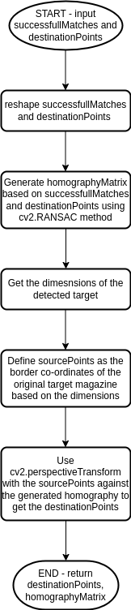

# Computer Science NEA - AR Video Magazine Covers
## General Requirements:
 - Python 3.XX
 - PyTesseract 
 - OpenCV 
 - PySimpleGUI

## Exhaustive Requirements (as per requirements.txt)
 - docopt==0.6.2
 - exceptiongroup==1.1.0
 - grip==4.6.1
 - hepunits==2.3.1
 - imutils==0.5.4
 - iniconfig==2.0.0
 - numpy==1.24.2
 - opencv-python==4.7.0.68
 - packaging==23.0
 - particle==0.21.2
 - path-and-address==2.0.1
 - pluggy==1.0.0
 - PySimpleGUI==4.60.4
 - pytesseract==0.3.10
 - pytest==7.2.1
 - tk==0.1.0
 - tomli==2.0.1

Automatic installation of all pre-requisites can be done using the included requirements.txt file:
~~~
pip3 install -r requirements.txt
~~~
The exhaustive requirements includes many which are already included with other packages. 

## Analysis:
### Introduction:
My project idea is to create either an investigation into, or a finalized app product which overlays a video of a pre-recorded magazine cover where the main image model is moving. This video is to be overlain on top of a printed magazine in real life (Augmented Reality). It should follow and adapt to the movements and angling that the camera is taking footage from.

### Who is the product for?
I want to create this product to help the school's Media Studies department, specifically Mr.Robson, create new, innovative interaction methods for student's GCSE, AS, and A level coursework. The coursework all involve creating either a magazine or a 'digipack' which also features a cover similar to a magazine. My product will allow them to deepen user imersion with their magazine or digipack while joining reality with digital. 

### Interview with Client:
#### What would you like the project to achieve?
"I'm looking for a project which can help the students of both GCSE and A Level Media Studies display their coursework. Most importantly I want something interactive to encourage engagement."
#### What are the key features of a program like this?
"It surely needs to easy to use as both myself and students will need to use the program to add their magazines. It also needs to be usable by people who visit who aren't students. This is as they need to experience the AR quickly and painlessly."
#### Are there any additional features you would be interested in?
"I think a 'batching' system to allow me to categorise classes would be useful. I could then organise AR products into yeargroups which would make it easy to manage."
#### What already exisiting AR or other related products interest you?
"Mainly I would say Google Maps is the only major AR product I use. It helps a lot with city navigation."
#### How do your current students display their magazine work?
"Right now they add their coursework onto their website portfolio. We also print out their work for displays and to allow us to see the work in print quality to make improvements more obvious."

### Main Objectives:
 - 1.0) Load target magazine image data
    - 1.1) store in an object
 - 2.0) Load source videos of pre-recorded moving covers in addition to webcam video 
    - 2.1) store source in an object which links to the target object (composition) 
    - 2.2) create methods to iterate frames 
 - 3.0) Detect and recognize which of the source videos matches to the magazine/digipack shown
    - 3.1) Create unique samples for detection of magazine covers
    - 3.2) Create my own sample detection system to match the samples to the webcam frame
 - 4.0) Detect edges and borders of the magazine/digipack
    - 4.1) Ensure the co-ordinates can be used in warping (generating homography)
 - 5.0) Frame by frame overlay and adjust the warping of the source to match the one in the video
    - 5.1) Warp the source video into the shape of the magazine in the webcam (applying homography)
    - 5.2) Creating my own bit-wise image operation methods
 - 6.0) Finally adapt the project for a user friendly interface GUI
    - 6.1) File-name input in GUI
    - 6.2) Pairs file generation in GUI so they don't have to be re-entered every time
    - 6.3) Batching of pairs via GUI into seperate groups - per client demands

### Already existing AR products:
#### Example 1: IKEA Place

Ikea Place is an app provided by the Swedish furniture company. It allows users who are browsing for furniture to place it inside of their home using their smartphone's camera. Allowing them to compare the size and aesthetic of the items. It also enourages users to create a more personal connection with the item being placed into their home via AR; making the app an effective sales technique. This relates to my project as it uses a projection in AR through a phone camera/webcam. It adjusts based on the movement of the camera. However my project does differ in some ways. Firstly, I would also have to adjust for when the camera is steady but the target (magazine) is moving. In IKEA Place, it's unlikely the target (floor or desk) would move instead of the camera. I also am using a different source. My AR is using a video feed whereas this uses a 3D model. The applications of my product are also different, being made for art and entertainment rather than commercial sales. 

#### Example 2: Snapchat filters

Snapchat filters are much more different to my project than Ikea Place. These AR filters track a users face to project things like masks, beards, tatoos and more onto them. It can be both 2D or 3D projections and they can respond to the users (for example some have physics implementations like to make wobbly noses when a persons head moves). I think the purpose of this product is more towards entertainment than Ikea Place, but much more so than my project. Snapchat filters are purely entertainment and novelty whereas AR magazine covers would be also informational. And of course theres the obvious difference in mine being non-3D model based.

#### Example 3: Pokemon GO

Pokemon Go is a 2016 mobile app which uses the iconic characters from Pokemon to make a location based video game. Users would have to physically move outside and the phone's GPS would register their location and move their character. Based on this they would encounter 'Pokemon' which they could try to 'capture'; capturing them is where AR and the link to my project arises as it would use the phones camera to AR project a 3D pokemon model. The user can also drag their finger across the screen to 'throw' a ball to catch them. My project doesn't involve this level of interactivity with the AR projection which could be something I need to consider implementing. 

#### Example 4: Google Maps Live View

Google in the past few years have rolled out a new feature in Google Maps on mobile. It's called 'Live View' and is used to allow you to see floating directional arrows and prompts for where to go if you're unsure in built-up areas with many alleys and possible routes. This stays tracked in position no matter where you point the smartphone as shown in the example image above. When first hearing of this idea it can feel somewhat gimmicky as holding up your phone in front of your face as a viewfinder for naviagtion could be distracting. However Google has developed the feature to use Google Street View data, another project where 360 cameras document city streets into a global database. Therefore when you use the AR Live View feature it not only creates these projections based on GPS, but also calibrates your location based on the camera feed data; making it useful even as purely a calibration tool. This is especially useful in built-up urban areas with poor signal.

### Software To Aid Development:
#### VSCodium:
This is a free and open-source fork of the Microsoft VSCode Integrated Development Environment. It has the same features as the main branch however the open-source aproach makes it more attractive. This is used for debugging my code. It can be found here: https://github.com/VSCodium/vscodium
#### NeoVim:
This is a code editor which is extremely light-weight and focuses on streamlining the development process. This is used in unison with VSCodium for debugging. It allows for almost all input through the keyboard. 
#### Python3:
Python is a high-level programming language with a focus on simple, 'English-like' syntax. While it's back-end is often considered inefficient in comparison to others, it's still a powerful language with many API and libraries avaliable which will no doubt be useful for a project which will need to integrate with webcams and other hardware.  

### Research On Algorithms / Aproaches That Could Be Used / External Libraries:
#### OpenCV Documentation - Displaying Video And Capturing Camera Feeds:
Source: https://docs.opencv.org/4.x/dd/de7/group__videoio.html , accessed November 5th 2022.

This page holds detailed information on how the Open Computer Vision Python library can used to load and write video information. 
It states that the syntax for the VideoCapture() method is:

~~~
cv::VideoCapture::VideoCapture(int -> index, int -> apiPreference = CAP_ANY)
~~~

In laymans terms this notation means that this is a part of the CV library which has a VideoCapture method. This can take two parameters:
The index which is an integer and your 'api preference' which is also an integer. The documentation page further elaborates to say that passing in a value of '0' will capture from to the systems default video device; typically the webcam. 

#### OpenCV Documentation - Homography Algorithms:
Source: https://docs.opencv.org/3.4/d9/dab/tutorial_homography.html , accessed November 5th 2022.

#### OpenCV Documentation - Bitwise Operators:
Source: https://docs.opencv.org/4.x/d0/d86/tutorial_py_image_arithmetics.html , accessed November 5th 2022.

#### OpenCV Documentation - Perspective Warp:
Source: https://theailearner.com/tag/cv2-warpperspective/ , accessed November 5th 2022.

#### OpenCV Documentation - Aruco Markers:
Source: https://docs.opencv.org/3.4/d5/dae/tutorial_aruco_detection.html , accessed November 5th 2022.

#### OpenCV Documentation - Resizing Images:
Source: https://www.tutorialkart.com/opencv/python/opencv-python-resize-image/ , accessed November 5th 2022.

#### OpenCV Documentation - Convolutions
Source: https://pyimagesearch.com/2016/07/25/convolutions-with-opencv-and-python/ , accessed November 5th 2022.
Source: https://developer.nvidia.com/discover/convolution , accessed November 5th 2022.

#### Python - Copy.deepcopy
Source: https://docs.python.org/3/library/copy.html , accessed November 5th 2022.

#### PyTesseract - Optical Character Recognition:
Source: https://nanonets.com/blog/ocr-with-tesseract/#nanonets-and-humans-in-the-loop , accessed November 5th 2022.

## Documented Design:

### UML Class Diagram

Below is a UML diagram to demonstrate how I plan to structure my program: 

I would like to highlight some areas of this:

Firstly, the Target and Webcam classes inherit from the File class. This is as both of these need to use the filepath attribute and the load()/getLoadedObj() methods. However they cannot be the same object as Target only needs to be for images, whereas Webcam needs additional methods like next() and getFrame() to iterate through the frames.

Furthermore, Source inherits from Webcam as it also uses video data. The Source class is then used inside of Target as it creates a link between magazine targets and the AR video that needs to be projected onto it; making storing a source instance inside of the target instance effective. This is represented by the 1-to-1 multiplicity which you can see in the UML diagram. 

The rest of the classes serve the purpose of manipulating/analysing data from the others. For example, Detect takes the Webcam instance and several Target instances and uses them to determine which image from Target can be seen in the data from Webcam. This data is then used by Border to find which coordinates in the Webcam data hold the detected Target, which is passed to Warp and Project, which uses Bitwise to manipulate the data and overlay the two. 

### GUI Diagrams

Below is a series of GUI diagrams to show how the user will interact and interface with my program. This serves to obfuscate the complexity of my code:

The top left diagram demonstrates how the program starts intially. It gives the user a textbox to enter a filename and three buttons. One button allows you to 'load' a .csv file which links target magazine covers with source video files to be projected onto them. The other two buttons, 'generate' and 'update' create a new .csv file if one has not been made previously.

When 'generate' or 'update' is clicked to leads to the top right diagram which provides two text boxes for filenames. If 'OK' is pressed it repeats this screen until 'Finish' is pressed to complete data entry. This then leads to the left middle screen titled 'Output'. The image it shows is the webcam with the AR effect applied. 

Furthermore my diagram contains three example error pop-ups. These include a file not found error and two file extension errors. 

### State Transistion Diagram

Below is a ST diagram which shows how inputs and return values affect the state the program is in:

The program starts on the 'Start Menu' state. If the user presses the 'Load' button it leads to the 'Load Files' state. This will lead to the 'File Not Found Pop-up' state if an error is returned, otherwise it will lead to the 'Detect' state. This state loops if the return is 'File Not Found' and enters the 'Show Webcam' state which loops back repeatedly until 'Target Found' is returned. This leads to the final accepting state, 'Project Onto Webcam'.  

On the other hand, if at the starting state the user selects the 'generate' or 'update' buttons, it will enter the 'Pairs Input' state. If 'OK' is input it will loop in this state until 'Finish' is input. This returns to the path taken above by enterting the 'Load Files' state.

### Structure Diagram

Below is a structure diagram which demonstrates the procedural decomposition of my problem into smaller and smaller chunks. This will greatly help me in understanding and developing my larger, overall project of an AR Magazine Projector. Therefore larger tasks seem more aproachable as it becomes a series of easier ones.

### Flowcharts

#### Border() Class Flowchart

#### Denary To Binary Flowchart

#### Sample Selection Flowchart

#### Optical Character Recognition Flowchart

#### Project() Class Flowchart

#### Aruco Detection Flowchart

### Prototype Proof-Of-Concept:
#### Detecting a target magazine

Above is an example of how OpenCV and it's ORB methods can be used to create a series of keypoints. These keypoints can uniquely indentify a target image. It even works through a webcam with non-ideal alignment or lighting thanks to being able to allow a certain degree of inaccuracy to still be accepted as a match. In the image above, OpenCV draws the matching points to demonstrate which areas correlate to the same points on the source. This will be important for my project as I need to recognize several magazine covers apart and load specific source videos to overlay on top. The way this works is by taking features of the magazine cover and making that a keypoint from the relationship between groups of pixels. For example you can see the bottom of the letters in MUSK are being used to identify the image from how the white pixels are spaced. The source code for this can be found in keypointDetection.py. 

#### Finding the border of the magazine

Here I add onto the above python file by taking the keypoints and relating them to the same keypoints found through the webcam. The difference in their distances allows for a homography matrix to be calculated. To do this I created a numpy array of the successful keypoints and used .reshape() to format it as a 2D array of 2 keypoints each. This is the accepted format for matching homography using cv2. This numpy array has to also be made for the keypoints in the original image. From this calculation we get a homography matrix. If done successfully this gives the data to perform a warp which matches to the image in the webcam. I then use cv2.perspectiveTransform to apply this warp to the border coordinates of the target image. This is then projected onto the webcam frame and can be seen above as the white box. 

#### Creating a mask

Above you can see a mask which is a white frame in the exact same size as the webcam frame. This is actually generated using numpy.zeros() which just makes a matrix of zeros in the resolution we pass in. OpenCV can interpret this matrix as an 'image' and display it for documentation and also for processing. Using the border points we previously created using homography, we can use OpenCV to draw a filled area where the target is in white (255,255,255). Following this we use a bitwise NOT to flip the colours to the target area being black (0,0,0) and the rest of the frame white (255,255,255). Leaving us with the final mask to overlay later. These binary RGB values should be noted as they're essential to the overlaying process. 

#### Warping the source video

Parallel to the mask we also generate this warped perspective of the source frame. This is done using cv2.warpPerspective which warps the frame by the homography matrix generated previously and then takes a width and height tuple. This tuple will allow us to place the warped source frame in the correct position in a 'frame' which is the same size as the webcam frame by passing in the same w and h values.

#### Create a mask over the webcam

Using the mask we created two images previously, we load the mask and the webcam frame using OpenCV. OpenCV has a method called bitwise_AND and also similar bitwise operations for all logic operations. Using this AND operation between the two images means that any data which is a 1 in the frst image and also a 1 in the second image will be output as also a 1. However if either of the inputs are 0, 0 will be output. If we link this specifically to the mask we created, the pixel areas where the magazine was not detected were filled with white which in rgb bits is (11111111,11111111,11111111). However where the target magazine was detected we filled with black which is (00000000,00000000,00000000). In contrast the webcam's bits will not be as uniform as white and black pixels and will likely be something similar to (1111000,1010001,1000011) as taken from a random sample pixel. If we apply the logic from the AND operation to the two zones we can understand why the image above is output. Firstly for the non-target areas in the mask, which are white, we will compare to the random sample pixel. If we AND (11111111,11111111,11111111) and (1111000,1010001,1000011) the output will be (1111000,1010001,1000011). As whenever there's a 0 in the webcam bits, there will be a 0 in the output, whenever theres a 1, there will be a 1 in the output. Therefore we can simplify this expression of (WebcamPixel AND WhitePixel) to simply (WebcamPixel). On the other hand, for the targeted zone which is in black, meaning 0 bits, when we do (00000000,00000000,00000000) AND (1111000,1010001,1000011) it will output (00000000,00000000,00000000) which means no matter what the webcam bit was, it will be output as 0. Therefore the logic expression of (WebcamPixel AND BlackPixel) can be simplified to (BlackPixel). Thereby this bit masking process leads to the image you see above which has the the webcam area without the magazine the exact same, but the area with the magazine target masked out in black. 

#### ANDing to finally project

Finally we have to compute one more bitwise operation between the previous step's masked webcam frame and the warped source frame. 

#### Prototype Review:
Overall the protyping of a 'proof-of-concept' was successful and will be useful in communicating with my client about the project's progress. However the libraries I used for this example program are pretty complex and take a lot of the pressure off of me as a programmer; as such I will need to research creating my own algorithms for sections of the OpenCV library to enhance my projects complexity. Examples of where my own implementations could be created are:
- Bitwise operations on images
- Warping Images
- Detecting images

Additionally my client will require a graphical interface. Currently the program hard-codes the paths for source and target files. This will need to be changed to a GUI and a new function or OOP structure to allow for unlimited source-target pairs to be detected and added as required. Iteration will therefore be key. 
A list of areas I could add functionality to/ improve on are:
- GUI 
- Allowing many sets of image/source pair files --> users may want to create categories via this
- Allow the user to select a 'performance' mode that only loads the first detected target and ignores other --> increases framerate

### Graphical Interface:
#### Using PySimpleGUI
For my program, I need to create a user-friendly interface. This is as my client is the schools media studies department who might not have time or the knowledge to hard-code filepaths or to navigate a command-line. Therefore from my research I've found that PySimpleGUI is an effective library to use for this purpose. It allows me to create graphical windows and input boxes which are essential. However, as the name suggests, it keeps the code required to get it working at a minimum. Therefore allowing me to focus on the backend further while still having an effective user interface.

As per https://www.pysimplegui.org/en/latest/#pysimplegui-users-manual we can utilise the following GUI elements for my project:
~~~
sg.Text("Text to be displayed")
~~~
This allows us to put text into the GUI window. This can help the user understand how to interface with the buttons and other interactive elements I use.
~~~
sg.OK(), sg.Cancel()
~~~
These elements can be used to create buttons which can be listened to detect interaction via .read() which returns a tuple of (event, values). These need to be read for every frame in a while loop to constantly detect whether either of these buttons are pressed in the events variable. Values on the other hand holds any data the user inputs.
~~~
sg.InputText()
~~~
Above is an example of how user inputs can be used to capture user generated data. This method allows a textbox to be added to the GUI which allows the user to type any text which can be captured via, as mentioned before, the values variable. 
~~~
sg.Slider(range, default_value, resolution, size, orientation)
~~~
This is an incredibly useful method for creating an interactive slider. This has several parameters which allow it to be customised. For example range allows the start and end values of the slider to be defined, default_value defines where the slider should start by default, resolution defines the step of the slider, for example in steps of 5 from 0 to 10 would give two options.
~~~
sg.FileBrowse()
~~~
Method which allows the user to select any file from their computer via a GUI based file browser. This is a nice way to allow filenames to be input with a more pleasant UX. 

### Making a bitwise operator class
I want to remove some of the OpenCV library methods and instead make my own algorithms to enhance my project. In this stage I want to start with creating my own bitwsie operator class for OpenCV images. 
#### How OpenCV stores pixel data
According to my source, https://datahacker.rs/how-to-access-and-edit-pixel-values-in-opencv-with-python/, the library stores images in a matrix of colour value tuples. In this case the arrangement of these pixels can be demonstrated by the image below:

In this layout the top left corner is considered the origin of the matrix and each value has an inverted (blue, green, red) tuple.
This method can be used to split an image into 3 seperated b,g,r values in different images. The usage is shown here:

~~~python
b, g, r = cv2.split(img)
~~~

Changining individual pixel colour can be done via the following syntax:

~~~python
img[50, 50] = (0, 0, 255)
~~~

This is exactly what I need for creating a bitwise operator class. 
I could now implement a bitwise operator class of my own using Python. 
The solution I arrived at can be seen below:

#### My implementation of bitwise operators on OpenCV images

~~~python
   def bitAnd(self,img, img2):
        # perform a bitwise AND between the two images
        # time speed of execution (for comparison with multiprocessing)
        start = time.perf_counter()
        height = img.shape[0]
        width = img.shape[1]
        if img.shape != img2.shape:
            sys.exit("ERROR - images are not the same size")
        # iterate through each row
        for column in range(0,height):
            # iterate through each column
            for row in range(0,width):
                # list to hold each pixels, RGB values after operation
                values = []
                # iterate and hold each images pixel colour values one by one for each colour
                for value in img[column, row]:
                    for value2 in img2[column,row]:
                        # use my binary converter to get binary values
                        value = self.decimalToBinary(value) 
                        value2 = self.decimalToBinary(value2)
                        # adjust the length of the values so that both have the same number of bits
                        if value > value2:
                            # .zfill(desiredLength) can be used on an str to fill with leading 0's
                            value2 = int(str(value2).zfill(len(str(value))))
                        elif value2 > value:
                            value = int(str(value).zfill(len(str(value2))))
                        # iterate through each bit in each value
                        for bit in value:
                            for bit in value2:
                                # perform a bitwise AND operation using if conditions
                                if value == 1 and value2 == 1:
                                    values.append(1)
                                else:
                                    values.append(0)
                        # perform AND operation on the bits and add to this pixels values
                        #values.append(value&value2)
                # ammend the pixel values in the respective pixel with the ANDed values
                img[column,row] = (values[0],values[1],values[2])
        # return the amended first image which now holds the values after being ANDed with all of image 2
        # also time how long the whole function took (for comparison with multiprocessing)
        end = time.perf_counter()
        print("Time taken:", end-start)
        return img

    def bitOr(self, img, img2):
        # perform a bitwise OR between the two images
        height = img.shape[0]
        width = img.shape[1]
        if img.shape != img2.shape:
            sys.exit("ERROR - images are not the same size")
        # iterate through each row
        for column in range(0,height):
            # iterate through each column
            for row in range(0,width):
                # list to hold each pixels, RGB values after operation
                values = []
                # iterate and hold each images pixel colour values one by one for each colour
                for value in img[column, row]:
                    for value2 in img2[column,row]:
                        # use my binary converter to get binary values
                        value = self.decimalToBinary(value) 
                        value2 = self.decimalToBinary(value2)
                        # adjust the length of the values so that both have the same number of bits
                        if value > value2:
                            # .zfill(desiredLength) can be used on an str to fill with leading 0's
                            value2 = int(str(value2).zfill(len(str(value))))
                        elif value2 > value:
                            value = int(str(value).zfill(len(str(value2))))
                        # iterate through each bit in each value
                        for bit in value:
                            for bit in value2:
                                # perform a bitwise AND operation using if conditions
                                if value == 1 or value2 == 1:
                                    values.append(1)
                                else:
                                    values.append(0)
                        # perform OR operation on the bits and add to this pixels values
                        # values.append(value|value2)
                # ammend the pixel values in the respective pixel with the ORed values
                img[column,row] = (values[0],values[1],values[2])
        # return the amended first image which now holds the values after being ORed with all of image 2
        return img

    def bitNot(self, img):
        # perfrom a bitwise NOT on an image
        height = (img.shape[0])
        width = (img.shape[1])
        for column in range(0,height):
            for row in range(0,width):
                # iterate through every pixel value
                # create list to store new values for this pixel
                values = []
                for value in img[column,row]:
                    # iterate through every pixel's RGB values, using a loop here as sometimes images have more than 3 values (CMYK)
                    # convert to binary using my converter method
                    value = self.decimalToBinary(value)
                    # use a bitwise NOT on the value
                    # values.append(~value)
                    for bit in str(value):
                        if int(bit) == 0:
                            values.append(1)
                        else:
                            values.append(0)
                img[column,row] = (values[0],values[1],values[2])
~~~

#### Review of my implementation

The solution I used above, while technically correct, has many major drawbacks. Firstly, the majority of the OpenCV based modules which achieve this task use external C language based programs. This is as the execution time for Python is just too slow for tasks which require rapid computation. In my project, I need to have this run every frame for at least ~20 frames per second to create a smooth motion for the user. Having a process like this take more than a second will make the program unusable for augmented reality purposes. When I tested this implementation using Python's built-in Time module, I found that a single execution of the bitAnd() method on a high resolution image took just under 500 seconds. This is without even using my own implementation of denary to binary conversion which would have slowed it down even more. The method I used for conversion can be seen below and used recursion:

~~~python
    def decimalToBinary(self,num,output=[]): 
        """takes a decimal number and uses recursion to return the binary value """
        # if the number is greater than 1
        if num > 1:
            # recur and half the number by 2 using integer division and also pass in the current output
            self.decimalToBinary(num//2,output)
        # then if the output is 1 or less we can append this to our output and return the output
        # when the output is not complete, the return closes the stack frame, 
        # but when the final stack is complete, it will return the final output out of the original call
        output.append(num%2)
        # make output a single string
        return int("".join(map(str,output)))
~~~

While it could be interesting to pursue making my own implementation of these bitwise operators work for my use-case, I think time would be better spent moving onto more interesting and impactful features of the project. However if I were to try solve this issue, I would look further into one of:
- Multiprocessing --> Multiple functions can be executed at once using multiple threads/cores. Therefore I could run several rows at a time. 
- Async --> While waiting on one task, another can be started. Therefore I could start on the next row before the first finished. 
- Pypy --> JIT('Just In Time') compiler for Python would allow me to execute my code faster as it keeps the machine code for already run functions.
- ShaderToy --> Shader software which would allow me to acess GPU computation power to apply a 'shader' to carry out these operators.
Nonetheless, this experience gave me an infinitely better understanding of how the modules I will end up using in my final project achieve what they do.

#### Higher-level implementation
As the recursive binary converter was too complex to be calculated at a suitable framerate, I've adjusted the code so that it works faster. This is done by using Python's bitwise operators rather than my own binary converter. This is slightly higher-level and allows Python to do some of the hard work for me. Nonetheless this uses no external libraries which was my main goal. 

~~~python
    def bitAnd(self,img, img2):
        # perform a bitwise AND between the two images
        height = img.shape[0]
        width = img.shape[1]
        if img.shape != img2.shape:
            sys.exit("ERROR - images are not the same size")
        # iterate through each row
        for column in range(0,height):
            # iterate through each column
            for row in range(0,width):
                # list to hold each pixels, RGB values after operation
                values = []
                # iterate and hold each images pixel colour values one by one for each colour
                for value in img[column, row]:
                    for value2 in img2[column,row]:
                        values.append(value&value2)
                # ammend the pixel values in the respective pixel with the ANDed values
                img[column,row] = (values[0],values[1],values[2])
        # return the amended first image which now holds the values after being ANDed with all of image 2
        return img

    def bitOr(self, img, img2):
        # perform a bitwise OR between the two images
        height = img.shape[0]
        width = img.shape[1]
        if img.shape != img2.shape:
            sys.exit("ERROR - images are not the same size")
        # iterate through each row
        for column in range(0,height):
            # iterate through each column
            for row in range(0,width):
                # list to hold each pixels, RGB values after operation
                values = []
                # iterate and hold each images pixel colour values one by one for each colour
                for value in img[column, row]:
                    for value2 in img2[column,row]:
                        # perform OR operation on the bits and add to this pixels values
                        values.append(value|value2)
                # ammend the pixel values in the respective pixel with the ORed values
                img[column,row] = (values[0],values[1],values[2])
        # return the amended first image which now holds the values after being ORed with all of image 2
        return img

    def bitNot(self, img):
        # perfrom a bitwise NOT on an image
        height = (img.shape[0])
        width = (img.shape[1])
        for column in range(0,height):
            for row in range(0,width):
                # iterate through every pixel value
                # create list to store new values for this pixel
                values = []
                for value in img[column,row]:
                    # iterate through every pixel's RGB values, using a loop here as sometimes images have more than 3 values (CMYK)
                    # use a bitwise NOT on the value
                    values.append(~value)
                img[column,row] = (values[0],values[1],values[2])
~~~

#### Fixing B&W Error

When projecting an image using this bitwise class, it makes the final output black and white. I debugged my code and found the error. Mainly this was due to performing an operation using a mask with only one value will make other colour channels be removed. Therefore I adjusted my code to account for more colour channels individually. A snippet of this can be seen below.

### Image Detection Implementation
#### Initial Aproach
I want to create my own implementation of OpenCV's image matcher and keypoint generator.
My initial ideas are to use a 'high-pass' filter on the target images to only get B&W data on hard edges.
This means that any colour variation caused by viewing the target through a webcam can be avoided.

#### High-Pass Filter + Convolution
<a href="https://www.youtube.com/watch?v=i76B1pBoN4Y">YouTube Video By Ritvik Math</a>
I used this video above to understand the basic elements of creating pass filters. He uses a purely mathematical aproach and explains thata kernel should be used to scan linearly across the 'time' of the input data. An example of a kernel for sound data would be [-1,1]. The majority of this video contextualises it using sound, however the exact same principle can be used for images. He even applies this at the end briefly. Instead of using the 'time' as the plain to apply across, we use the 'space' of the image. Furthermore a high-pass kernel for images would be multi-dimensional. For example, 

[-1,0,1,

-2,0,2,

-1,0,1]

[1,2,1,

0,0,0,

-1,-2,-1]

The main concept is that, in the example of the more simple kernel: [-1,1], the left value is applied to the value on the left of the current position while the right value is applied to the right. In essence this creates a a differential between the two values next to each other, allowing us to capture data on the contrast between these two datapoints. 
We can then set a tolerance for how high the contrast has to be before being accepted or blocked by our filter. If high contrast is blocked, we create a low-pass filter which blurs the image. 

Whereas if low contrast is blocked, we create a high-pass filter which only shows hard edges. 

From my research I found that this is one the most popular convolution kernels for image high-pass filters. In essence, it means that we take the current pixel (represented by the middle kernel value), multiply it's greyscaled value by 8, then we access the pixels around that current pixel in memory and multiply all those values by -1. The result of each calculation should be summed as the differential between the current versus surrounding pixels. 

##### Intial attempt

Below is python code which I used to implement the formula onto target images in my project. I used index locations to access surrounding pixel values. This is more efficient than storing them and iterating. I then multiply each by their respective kernel values. This is summed to create the single differntial value.

The paramter 'size' gives the resolution width and height of the square sample we want to create. This can be used to create several unique samples across the target image. For example, four smaller high-pass images from the four corners of the image.

~~~python
    def myHighPass(self,size,img):
        # size paramter limits how much of the image we filter and use
        # this can improve performance if image is high resolution
        # create a blank mask of empty zero values in size of sample
        mask = np.zeros(shape=(size,size))
        print(mask)
        # iterate through each position in the empty matrix
        for i in range(0,size):
            for j in range(0,size):
                # change each position in the empty image to be the difference between the values in a 9*9 grid around the central current position
                mask[i][j]= -1*img[i][j]-1*img[i][j+1]-1*img[i][j+2]-1*img[i+1][j]+8*img[i+1][j+1]-1*img[i+1][j+2]-1*img[i+2][j]-img[i+2][j+1]-1*img[i+2][j+2]

        # output the differentials between the pixels. 
        # later to be used with a threshold accept value.
        print(mask)
        cv2.imshow("mask", mask)
        cv2.waitKey(0)
~~~

The result of this program run using a sample size of 500 is shown in the screenshot below. This leads to the diffential values being saved as pixel values and displayed. As you can see this isn't quite the result we need as we've yet to set a boundary accept value for the filter. 

##### Setting a threshold filter value

My code is now adjusted to only set pixel values if the differential is above 80. This leave only very hard edges in the final output.

~~~python
    def myHighPass(self,size,img):
        # size paramter limits how much of the image we filter and use
        # this can improve performance if image is high resolution
        # create a blank mask of empty zero values in size of sample
        mask = np.zeros(shape=(size,size))
        print(mask)
        # iterate through each position in the empty matrix
        for i in range(0,size):
            for j in range(0,size):
                #  get the difference between the values in a 9*9 grid around the central current position
                differential = -1*img[i][j]-1*img[i][j+1]-1*img[i][j+2]-1*img[i+1][j]+8*img[i+1][j+1]-1*img[i+1][j+2]-1*img[i+2][j]-img[i+2][j+1]-1*img[i+2][j+2]
                
                # if this differential is greater than 80, we accept it as a hard edge and add it as a pixel value
                if differential > 80:
                    mask[i][j] = differential
        # output the high passed sample. 
        print(mask)
        cv2.imshow("mask", mask)
~~~

The output is now shown here after adding a boundary threshold.

##### Linking to OOP structure

In order to link this filter into my plans for my greater project I need to link it to the target object. This is to allow samples to be accessed when detecting and also to allow these keypoints to be linked to a specific magazine. 

The code below is a setter for a new attribute I've added in my target objects initialisation. The '\_myPoints' attribute is an empty list by default which we can append values into to be set as samples to look for when detecting for that respective magazine cover.

~~~python
    def mySetPoints(self,sample):
        # Using my own implementation of image detection which can be used when in 'performance' mode.
        self._myPoints.append(sample)
~~~

Furthermore, my implementation of the high-pass sample generator has been amended to take a target object instead of an image object and instead of returning, it will use the above setter.

~~~python  
    def myHighPass(self,size,target):   
        # size paramter limits how much of the image we filter and use
        # this can improve performance if image is high resolution
        # create a blank mask of empty zero values in size of sample
        mask = np.zeros(shape=(size[1],size[1]))
        print(mask)
        # iterate through each position in the empty matrix
        for i in range(size[0],size[1]):
            for j in range(size[0],size[1]):
                # find the overall summed difference between the values in a 9*9 grid around the central current position
                differential = -1*img[i][j]-1*img[i][j+1]-1*img[i][j+2]-1*img[i+1][j]+8*img[i+1][j+1]-1*img[i+1][j+2]-1*img[i+2][j]-img[i+2][j+1]-1*img[i+2][j+2]
                
                # if this overall differences with the surrounding pixels is greater than 80, we accept it as a hard edge and adjust that pixel to be shown equal to how hard the edge is.
                if differential > 80:
                    mask[i][j] = differential

        # crop the mask to only show the sampled area
        mask = mask[size[0]:size[1],size[0]:size[1]]
        target.mySetPoints(mask)

~~~
##### Performance Improvements Using OpenCV 2DFilter

To speed up the application of my convolution I've adjusted my code to now use OpenCV's 2DFilter method which takes a convolution matrix I defined and applies it to an image. I then further speed up my code by using boolean indexing to filter out any values which do not meet my highpass threshold.

~~~python
        # create a blank mask of empty zero values in size of sample
        mask = np.zeros(shape=(size[1]+10,size[1]+10), dtype=np.float32)
        # create a deep copy of the target so that the original image is not affected, and change to grayscale
        target_gray = cv2.cvtColor(target, cv2.COLOR_BGR2GRAY).astype(np.float32)
        # calculate the kernel for the 3x3 grid
        kernel = np.array([
                        [-1, -1, -1],
                        [-1,  8, -1],
                        [-1, -1, -1],], dtype=np.float32)
        # use OpenCV's filter2D function to convolve the kernel with the image to calculate the overall summed difference
        differential = cv2.filter2D(target_gray, -1, kernel, borderType=cv2.BORDER_CONSTANT)
        differential = differential[0:size[1]+10,0:size[1]+10]
        # if the overall difference with the surrounding pixels is greater than 60, adjust that pixel to be shown equal to how hard the edge is
        mask[differential > 50] = differential[differential > 50]
        # crop the mask to only show the sampled area
        mask = mask[size[0]:size[1],size[0]:size[1]]
~~~

I've also further optimised the framerate of my program by having webcam resolutions and target resolutions reduced (currently to 70% their original size) using cv2.resize()

~~~python
    targets[0].resize(int(targets[0].getLoadedObj().shape[1]*0.7),int(targets[0].getLoadedObj().shape[0]*0.7))
~~~
#### Smart Sample Selection

To improve the quality of samples I generate I made the target method myGenPoints() use a system which parses diagonally across the target and only takes samples with a combined pixel value above 150,000, otherwise it takes the next best previous sample.

~~~python
    def myGenPoints(self):
        # generates keypoints using my own implementation in Detect class
        # this also ensures that the samples generated have enough features within them using .sum()
        detect = Detect()
        sum_of_pixels = 0
        # this holds previous samples, if we fail to get a good match, we take this next best choice
        previous = {}
        position = 100 
        h,w,c = self.getLoadedObj().shape
        while sum_of_pixels < 150000:
            # prevent going over edge of image
            if position + 99 > w:
                # if we go over edge, take the best previous sample
                key = max(previous.keys())
                self._myPoints[0] = previous[key]
                break
            self._myPoints[0] = cv2.convertScaleAbs(detect.myHighPass(size=[position,100+position],target=self.getLoadedObj()))
            sum_of_pixels = np.sum(self._myPoints[0])
            cv2.imshow("parsing",self._myPoints[0])
            cv2.waitKey(0)
            # save the current sample incase we overrun
            previous[sum_of_pixels] = copy.deepcopy(self._myPoints[0])
            # move our parse
            position += 100
        cv2.imshow("sample gen", self._myPoints[0])
        cv2.waitKey(0)
~~~

A visualisation of this process can be seen below:

## Testing
### Unit Testing For Bitwise()

~~~python
# testing for bitwise.py using pytest
from bitwise import Bitwise
import cv2

bitwise = Bitwise()

img = cv2.imread("../target.jpg")
img1 = cv2.imread("../target2.jpg")
img2 = cv2.imread("../target3.jpg")
img3 = cv2.imread("../targetREAL.jpg")

h,w,c = img.shape
img1 = cv2.resize(img1,(w,h))
img2 = cv2.resize(img2,(w,h))
img3 = cv2.resize(img3,(w,h))

testANDresult1 = cv2.bitwise_and(img,img1)
testANDresult2 = cv2.bitwise_and(img2,img3)
testORresult1 = cv2.bitwise_or(img,img1)
testORresult2 = cv2.bitwise_or(img,img1)
testNOTresult1 = cv2.bitwise_not(img)
testNOTresult2 = cv2.bitwise_not(img1)

def test_binary():
    assert bitwise.decimalToBinary(10,[]) == 1010
    assert bitwise.decimalToBinary(1,[]) == 1
    assert bitwise.decimalToBinary(15,[]) == 1111
    assert bitwise.decimalToBinary(255,[]) == 11111111

def test_and():
    assert bitwise.bitAnd(img,img1).all() == testANDresult1.all()
    assert bitwise.bitAnd(img2,img3).all() == testANDresult2.all()

def test_or():
    assert bitwise.bitOr(img,img1).all() == testORresult1.all()
    assert bitwise.bitOr(img2,img3).all() == testORresult2.all()

def test_not():
    assert bitwise.bitNot(img).all() == testNOTresult1.all()
    assert bitwise.bitNot(img1).all() == testNOTresult2.all()
~~~

### Unit Testing For Search()

~~~python
# test file for search.py
from search import Search

def test_sort():
    search = Search(None,[3,2,1,6])
    assert search.sort() == [1,2,3,6]
    search = Search(None,[1,2,3,4])
    assert search.sort() == [1,2,3,4]
    search = Search(None,[1,1,1,1,2,1,1,1,1,1])
    assert search.sort() == [1,1,1,1,1,1,1,1,1,2]
    search = Search(None,["a","b","c"])
    assert search.sort() == ["a","b","c"]
    search = Search(None,["c","b","a"])
    assert search.sort() == ["a","b","c"]

def test_search():
    search = Search("a-file", ["c-file","b-file","a-file"])
    search.sort()
    assert search.search() == True
    search = Search("a-file", ["a-file","b-file","c-file"])
    search.sort()
    assert search.search() == True
    search = Search("a-file", ["c-file","a-file","b-file"])
    search.sort()
    assert search.search() == True
    search = Search("a-file", ["b-file","c-file","d-file"])
    search.sort()
    assert search.search() == False
~~~

### Testing Final Product With High-Level Mode
For these tests, 'high-level' means my code will use cv2 based methods as much as possible to enhance performance.

### Testing Final Product With Low-Level Mode
For these tests, 'low-level' means my code will use my own implementations as much as possible and therefore performance will be slower.

### Testing Final Product With Compression
I implemented a slider to improve performance if the user decides it's needed. This can go from 0.7x size to 1.0x size in 0.1 increments. 

### Testing Final Product With Keypoints
This is a test to see if using object keypoints to detect unique magazines works. 

### Testing Final Product With Aruco Markers
This is a test to see if the target is still tracked when using aruco markers.

### Testing Final Product With Optical Character Recognition
This checks the accuracy of OCR when used on the original target image. It also needs to be layered on top of each projected source frame. 

### Video Tests Including Final Client Use-Case
#### 3rd person view 
https://youtu.be/0VBcbq0p-C8

### Series of screen-recorded tests
https://youtu.be/9YzmsHYRRgA

## Technical Solution
Below are seperated sections for each file of my overall project. 
According to CLOC, a program which counts lines of code, this contains just under 1000 lines including comments.

### main.py
~~~python
"""In this file I want to create a class structure for my code. This is based upon the projectvideo.py file.
My plan is to create a 'file' class which then allows for a source, target and webcam class to inherit from. 
Then a main() function will create instances of these classes and run the iteration and processesing for some aspects.
I want to make processing inside class methods as much as I can so I'm going to make the warping of images, projection and 
detection into their own objects.  
Some classes will be placed in a filesystem of objects which are in this folder.
Overall this file will be focused on GUI implementation and calling class methods."""

# import our external libraries of:
# OpenCV for image manipulation, 
# PySimpleGUI for GUI, 
# os is for identify filepaths,
# sys is for error handling,
# and built-in python csv library for saving and loading data
import cv2
import PySimpleGUI as sg
import csv
import os
import sys
import copy
from warp import Warp
from project import Project
from detect import Detect
from border import Border
from webcam import Webcam
from source import Source
from target import Target
from search import Search

def GUIgen():
    """The second GUI to get the target and source file locations"""
    event, values = sg.Window('Provide the files', [[sg.Text("This will pop-up continously until 'finish' button is pressed")],
                                                    [sg.Text('File for target magazine cover')], 
                                                    [sg.Input(), sg.FileBrowse()],[sg.Text('File for source video to be projected')], 
                                                    [sg.Input(), sg.FileBrowse()], 
                                                    [sg.OK(), sg.Button('Finish')] ]).read(close=True)
    if event == 'Finish':
        return None, None
    else:
        return values[0], values[1]

def GUI():
    """This is the first GUI page which gets the user to either provide or generate a .csv pair file"""
    # set the theme
    sg.theme('DarkAmber') 
    # sets the layout of the GUI
    layout = [  [sg.Text('For the AR to work, a savefile of source videos and target magazine cover images needs to be loaded.')],
                [sg.Text('Enter filename (ending in .csv):')],
                [sg.Input()],
                [sg.Text('How to continue?:')],
                [sg.Button('Load'), sg.Button('Generate'), sg.Button("Update") ],  
                [sg.Checkbox('Enable low-level mode? (slower)', default=False, key='lowLevel')],
                [sg.Checkbox('Auto-generate text? (imperfect)', default=False, key='autoText')],
                [sg.Text('Compression size (lower is smaller):')],
                [sg.Slider(range=(0.7, 1.0), resolution=0.1, orientation='horizontal', key='lowRes', default_value=100)]]
    # makes a window
    window = sg.Window('AR Magazine Projector', layout)
    # loops to scan for events and capture user inputs
    while True:
        event, values = window.read()
        if event == sg.WIN_CLOSED: 
            break
        elif event == 'Load':
            window.close()
            # values["-IN-"] returns the boolean value of the checkbox, True meaning ticked
            return "l",values[0],values["lowLevel"],values["lowRes"],values["autoText"]
        elif event == 'Generate':
            window.close()
            return "g",values[0],values["lowLevel"],values["lowRes"],values["autoText"]
        elif event == 'Update':
            window.close()
            return "u",values[0],values["lowLevel"],values["lowRes"],values["autoText"]
    # close the window if the user breaks the event check loop
    window.close()

def generateCSV(pairings, createOrUpdate,fileName,autoText):
    # this will use file I/O and the csv library to take the pairing dictionary list and either write or append to 
    # a pairs.csv file.
    with open(fileName,createOrUpdate) as file:
        # use the csv library's dictionary writer to make the .csv file's heading (if creating) and for later writing each dict
        dictwriter = csv.DictWriter(file, fieldnames=pairings[0].keys())
        if createOrUpdate == "w":
            dictwriter.writeheader()
        # iterate through the pairs list to get each dictionary 
        for pair in pairings:
            dictwriter.writerow(pair)
    return loadPairs(fileName,autoText)

def generatePairs(createOrUpdate, fileName, autoText):
    # create a csv file of the target and source pairs if one does not exist
    # allow user to keep entering target and source pair filenames with .mp4 and .jpeg images until ctrl+D
    # verify input using regex
    targetSource = []
    userNotDone = True
    pairing = {}
    while True:
        fileTarget, fileSource = GUIgen()
        if fileTarget == None:
            break
        # seperate the file extensions using os library 
        name,ext = os.path.splitext(fileTarget)
        name1,ext1 = os.path.splitext(fileSource)
        # check that both file extensions are valid to avoid OpenCV compatability errors
        if ext in [".jpg",".jpeg"] and ext1 == ".mp4":
            # if valid update the dictionary pair and append it to the list
            pairing["target"] = copy.deepcopy(fileTarget)
            pairing["source"] = copy.deepcopy(fileSource)
            targetSource.append(copy.deepcopy(pairing))
        else:
            sg.popup('ERROR', 'File extension must be .jpeg/.jpg for the target and .mp4 for the source')
    # once loop is broken we call the file generator function
    return generateCSV(targetSource,createOrUpdate,fileName,autoText)

def loadPairs(fileName,autoText):
    with open(fileName, "r") as file:
        reader = csv.DictReader(file)
        targets = []
        sources = []
        counter = 0
        for row in reader:
            # we make an append to an array of each object we create for target and source respectively
            targets.append(Target(row["target"],sourceObj=Source([row["source"]],autoText)))
            counter += 1
        return targets

def main():
    while True:
        # Here loadOrGen tells us whether we load fileName or generate a file called fileName. lowLevel determines if we use a mix of my own implementation and OpenCV (slow) or all OpenCV's (fast)
        loadOrGen, fileName, lowLevel, lowRes, autoText = GUI()
        name, ext = os.path.splitext(fileName)
        correctInput = True
        if ext != ".csv":
            sg.popup('error','File extension must be .csv')
            correctInput = False
        if loadOrGen == "l" and correctInput == True:
            # create an instance of the search class ass set the target as the pairs file and the files to search as the current working directory
            path = os.getcwd()
            search = Search(fileName, os.listdir(path))
            search.sort()
            if search.search():
                # get the tuple of loaded target cv2 objects and loaded source cv2 objects
                targets = loadPairs(fileName,autoText)
                break
            else:
                sg.popup('ERROR', 'File not found')
                sys.exit("ERROR - pairs.csv file not found. please generate first.")
        elif loadOrGen == "g" and correctInput == True:
            # call the generate function and pass in "w" to create or overwrite a pairs.csv file
            targets = generatePairs("w",fileName,autoText)
            break
        elif loadOrGen == "u" and correctInput == True:
            # using the same generate function except pass in "a" to append to an already exisiting pairs.csv file
            targets = generatePairs("a",fileName,autoText)
            break
    # now that we have the data for every target and source intialized in a dictionary we can begin using the class methods to create the ouput
    # first we intialize the webcam
    webcam = Webcam(lowRes=lowRes)
    webcam.load()
    targets[0].load()
    targets[0].getSourceObj().load()
    if lowRes:
        # resize to be 0.8x size to increase framerate
        targets[0].resize(int(targets[0].getLoadedObj().shape[1]*lowRes),int(targets[0].getLoadedObj().shape[0]*lowRes))
    h1,w1,c1 = targets[0].getLoadedObj().shape
    targets[0].myGenPoints()
    targets[0].genPoints()
    targets[0].replicateText()
    for target in targets[1:]:
        target.getSourceObj().load()
        target.load()
        target.resize(w1,h1)
        # this generates the samples for target detection. This has recently be changed to be outside the loop to increase framerate
        target.myGenPoints()
        target.genPoints()
        target.replicateText()
        # use the Detect class detect() method to get which object is in the frame (if any)
    # now we can create a loop based on each frame of the webcam we load
    while True:
        # call the method which loads the next frame
        result = None
        webcam.next()
        try:
            # NOTE: source objects are stored WITHIN their respective target objects
            for target in targets:
                target.getSourceObj().next(w1,h1)
        except cv2.error:
            # if we fail to load the next frame we should loop the source videos by reloading them now
            targets[0].getSourceObj().load()
            targets[0].getSourceObj().next(w1,h1)
            for target in targets[1:]:
                target.getSourceObj().load()
                target.getSourceObj().next(w1,h1)
        else:
            # use the Detect class detect() method to get which object is in the frame (if any)
            detect = Detect(webcam, targets)
            # this uses a lower level implementation which gets just which target is in the webcam
            if lowLevel:
                detectedTarget = detect.myDetect()
            else:
                detectedTarget = None
            # this uses a higher level OpenCV implementation which also gets matches for a homography calculation
            result = detect.detect()
        # if there is a targetted magazine detected
        if (detectedTarget is not None or lowLevel == False) and (result is not None):
            # ensure both my detect and OpenCV's detect are in agreement
            successfullMatches, detectedTargetCheck, arucoBorders = result
            if detectedTarget == detectedTargetCheck or (lowLevel == False):
                if lowLevel == False:
                    detectedTarget = detectedTargetCheck
                border = Border(detectedTarget, webcam, successfullMatches, arucoBorders)
                borderResult = border.border()
                if borderResult != None:
                    destinationPoints, homographyMatrix = borderResult
                    print("BORDER CALCULATED")
                    h,w,c = webcam.getFrame().shape
                    warp = Warp(target.getSourceObj().getFrame(), homographyMatrix, [w,h])
                    warpedSource = warp.warp()
                    print("SOURCE WARPED")
                    project = Project(webcam.getFrame(), warpedSource, destinationPoints)
                    # check which mode the program is in
                    if lowLevel:
                        project.myProject()
                    else:
                        project.project()
                    print("PROJECTED ONTO WEBCAM")
                    buttonPress = cv2.waitKey(1)
                    if buttonPress == 81 or buttonPress == 113:
                        sys.exit()
        else:
            # if there is no detected target, we still display the plain webcam to keep motion smooth
            cv2.imshow("Output",webcam.getFrame())
            buttonPress = cv2.waitKey(1)
            if buttonPress == 81 or buttonPress == 113:
                sys.exit()

# if we're running the main.py file, run the main() subroutine
# this prevents issues with imported files
if __name__ == "__main__":
    main()
~~~

### file.py
~~~python
"""The class for files as OpenCV objects"""
import cv2
class File():
    def __init__(self, filepath):
        self.filepath = filepath
        self._loadedObj = None
    
    # the getter for the filepath attribute
    @property
    def filepath(self):
        return self._filepath

    # the setter for the filepath attribute
    @filepath.setter
    def filepath(self,path):
        try: 
            # ensure the path isn't an invalid datatype
            int(path)
        except (TypeError, ValueError):
            self._filepath = path
            return True
        else:
            return False

    # getter for the loadedObj attribute
    def getLoadedObj(self):
        return self._loadedObj

    # loads the file from the filepath attribute and loads it as an OpenCV object, saved in the loadedObj attribute
    def load(self):
        self._loadedObj = cv2.imread(self.filepath)
~~~

### source.py
~~~python
"""This is the class for source videos which inherits from the webcam class"""
from webcam import Webcam
import cv2
class Source(Webcam):
    """
    This is the Source class which inherits from the Webcam class.
    It similarly loads frames however from a file rather than a video capture device.
    """
    def __init__(self,filepath,autoText):
        # intialize the filepath from the parent class which is Webcam which then passes into that parent class which is File
        super().__init__(filepath=filepath)
        self.frame = None   
        self.autoText = autoText
    
    @property
    def frame(self):
        return self._frame
    
    @frame.setter
    def frame(self,frame):
        self._frame = frame
    
    @property
    def autoText(self):
        return self._autoText
    
    @autoText.setter
    def autoText(self,autoText):
        self._autoText = autoText

    # Getter for frame 
    def getFrame(self):
        return self._frame
    
    # Loads the video file - polymorphism of load() method in File/Webcam class
    def load(self):
        # Load the video file from the path and and assign to loadedVid attribute
        print(self.filepath)
        self._loadedVid = cv2.VideoCapture(self.filepath[0])
    
    # Loads the next frame of the video
    def next(self,w,h):
        # Here loadedBool is a True/False of whether the video has ended
        self._loadedBool, self._frame = self._loadedVid.read()
        self._frame = cv2.resize(self._frame,(w,h))
        if self._autoText:
            # add the detected OCR text onto the source frame
            # for each detected word
            for boxIndex in range(len(self._text['text'])):
                # get that word's detected location in x and y
                x,y = self._text['left'][boxIndex], self._text['top'][boxIndex]
                # insert text at that location with the same content
                cv2.putText(self._frame,self._text['text'][boxIndex],(x,y),cv2.FONT_HERSHEY_SIMPLEX,0.8,(255,255,255))
        
    def setText(self,data):
        self._text = data
~~~

### target.py
~~~python
"""This is file for the target class which inherits from the file class"""
import cv2
from file import File
from detect import Detect
import numpy as np
import copy
from text import Text

class Target(File):
    """
    This is the Target class. It inherits from the File class. 
    It holds an OpenCV image object in it's attributes alongside
    it's keypoint data for later detection and recognition. 
    """
    def __init__(self, filepath, sourceObj):
        # Intialize the parent class, File using the filepath Parameter
        super().__init__(filepath)
        self.sourceObj = sourceObj
        self.myPoints = [None]

    @property
    def sourceObj(self):
        return self._sourceObj
    
    @sourceObj.setter
    def sourceObj(self, sourceObj):
        self._sourceObj = sourceObj

    @property
    def myPoints(self):
        return self._myPoints
    
    @myPoints.setter
    def myPoints(self, myPoints):
        self._myPoints = myPoints

    # Method to generate the descriptors and keypoints
    def genPoints(self):
        orb = cv2.ORB_create(nfeatures=1000)
        # Create descriptor and keypoint attributes which can be used for target detection later
        self._keyPoints, self._descriptors = orb.detectAndCompute(self.getLoadedObj(),None)

    def mySetPoints(self,sample):
        # Using my own implementation of image detection which can be used when in 'performance' mode.
        self._myPoints.append(sample)
    
    def myGenPoints(self):
        # generates keypoints using my own implementation in Detect class
        # this also ensures that the samples generated have enough features within them using .sum()
        detect = Detect()
        sum_of_pixels = 0
        # this holds previous samples, if we fail to get a good match, we take this next best choice
        previous = {}
        h, w, c = self.getLoadedObj().shape
        # scan horizontally
        for y in range(0, h, w//4):
            for x in range(0, w, w//4):
                # prevent going over edge of image
                if x + (w//4-1) > w or y + (w//4-1) > h:
                    continue
                self._myPoints[0] = cv2.convertScaleAbs(detect.myHighPass(size=[w//4, w//4], target=self.getLoadedObj(), x=x, y=y))
                sum_of_pixels = np.sum(self._myPoints[0])
                # save the current sample incase we overrun
                previous[sum_of_pixels] = copy.deepcopy(self._myPoints[0])
                # if we found a good sample, break out of loops
                if sum_of_pixels >= 2000000:
                    break
            if sum_of_pixels >= 2000000:
                break
        # if we haven't found a good sample yet, scan vertically
        if sum_of_pixels < 2000000:
            for x in range(0, w, w//4):
                for y in range(0, h, w//4):
                    # prevent going over edge of image
                    if x + (w//4-1) > w or y + (w//4-1) > h:
                        continue
                    self._myPoints[0] = cv2.convertScaleAbs(detect.myHighPass(size=[w//4, w//4], target=self.getLoadedObj(), x=x, y=y))
                    sum_of_pixels = np.sum(self._myPoints[0])
                    # save the current sample incase we overrun
                    previous[sum_of_pixels] = copy.deepcopy(self._myPoints[0])
                    # if we found a good sample, break out of loops
                    if sum_of_pixels >= 2000000:
                        break
                if sum_of_pixels >= 2000000:
                    break
        # if we still haven't found a good sample, take the best previous sample
        if sum_of_pixels < 2000000:
            key = max(previous.keys())
            self._myPoints[0] = previous[key]

    def replicateText(self):
        # intialise the text class and set it's target as this instance
        text = Text(self)
        # process this target image
        text.process()
        # extract data from the processed image
        text.extract()
        # apply to source
        text.addText()
    
    def myGetPoints(self):
        return self._myPoints

    def getSourceObj(self):
        return self._sourceObj

    # getter for descriptors
    def getDescriptors(self):
        return self._descriptors

    # getter for keyPoints
    def getKeyPoints(self):
        return self._keyPoints

    def resize(self,w,h):
        self._loadedObj = cv2.resize(self._loadedObj,(w,h))
~~~

### webcam.py
~~~python
"""This is the class for webcam objects which inherits from the file class"""
from file import File
import cv2
class Webcam(File):
    """
    This is the Webcam class which inherits from the File class
    """
    def __init__(self,filepath=None,lowRes=False):
        super().__init__(filepath)
        self.frame = None
        self.descriptors = None
        self.keyPoints = None
        self.loadedBool = None
        self.loadedWeb = None
        self.lowRes = lowRes

    @property
    def frame(self):
        return self._frame
    
    @frame.setter
    def frame(self,frame):
        self._frame = frame
    
    @property
    def descriptors(self):
        return self._descriptors
    
    @descriptors.setter
    def descriptors(self,descriptors):
        self._descriptors = descriptors

    @property
    def keyPoints(self):
        return self._keyPoints
    
    @keyPoints.setter
    def keyPoints(self,keyPoints):
        self._keyPoints = keyPoints

    @property
    def loadedBool(self):
        return self._loadedBool
    
    @loadedBool.setter
    def loadedBool(self,loadedBool):
        self._loadedBool = loadedBool
    
    @property
    def loadedWeb(self):
        return self._loadedWeb
    
    @loadedWeb.setter
    def loadedWeb(self,loadedWeb):
        self._loadedWeb = loadedWeb

    @property
    def lowRes(self):
        return self._lowRes
    
    @lowRes.setter
    def lowRes(self,lowRes):
        self._lowRes = lowRes

    # Method to generate the descriptors and keypoints
    def genPoints(self):
        orb = cv2.ORB_create(nfeatures=1000)
        # Create descriptor and keypoint attributes which can be used for target detection later
        self._keyPoints, self._descriptors = orb.detectAndCompute(self._frame,None)

    # Getter for descriptors
    def getDescriptors(self):
        return self._descriptors

    # Getter for keyPoints
    def getKeyPoints(self):
        return self._keyPoints

    # Getter for frame 
    def getFrame(self):
        return self._frame

    # Loads the webcam feed - polymorphism of load() method in File class
    def load(self):
        # Load the default webcam feed and assign to loadedWeb attribute
        self._loadedWeb = cv2.VideoCapture(0)

    # Loads the next frame of the webcam
    def next(self):
        # Here loadedBool is a True/False of whether the feed is ended
        self._loadedBool, self._frame = self._loadedWeb.read()
        dimensions = self._frame.shape
        if self._lowRes:
            # Resize the image to increase framerate
            self._frame = cv2.resize(self._frame, (int(dimensions[1]*self._lowRes), int(dimensions[0]*self._lowRes)))
~~~

### search.py
~~~python
""" This is a class for searching a filesystem for a filename. It allows more forgiving user input than default python"
"""
class Search():
    def __init__(self, filename, unordList):
        self.filename = filename
        self.unordList = unordList
        self.sortedDir = None

    @property
    def filename(self):
        return self._filename
    
    @filename.setter
    def filename(self, filename):
        self._filename = filename

    @property
    def unordList(self):
        return self._unordList
    
    @unordList.setter
    def unordList(self, unordList):
        self._unordList = unordList

    @property
    def sortedDir(self):
        return self._sortedDir
    
    @sortedDir.setter
    def sortedDir(self, sortedDir):
        self._sortedDir = sortedDir

    def sort(self):
        """
        this method uses insetion sort to sort the files in the directory currently searching
        necesary to allow for searching later with binary search
        in insertion sort we take values in an unsorted list and continously insert them into their appropriate position in a sorted list
        """
        # insertion sort --> O(n^2) time complexity 
        # for each item in the unordered list
        for i in range(1, len(self._unordList)):
            position = i 
            # while we arent at the start index and the current element is less than the previous element,
            while position > 0 and self._unordList[position-1] > self._unordList[position]:
                # swap the two elements if they are not in the correct order
                self._unordList[position], self._unordList[position-1] = self._unordList[position-1], self._unordList[position]
                # change the position value to be the previous element
                position -= 1
        # once all loops are broken, set the sortedDir attribute to the sorted list
        self._sortedDir = self._unordList

        # line below only used if testing the function with pytest
        return self._sortedDir

    def binarySearch(self,sortedDir,target,start,end):
        if start > end:
            # file not found, return False
            return False
        else:
            # calculate mid-point
            mid = (start + end) //2
            # check if mid-point is the file 
            if target == sortedDir[mid]:
                # file exists, return True
                return True
            # otherwise check if file would be above or below the mid-poiny
            elif target > sortedDir[mid]:
                # recur and exclude the first half of the list
                return self.binarySearch(sortedDir,target,mid+1,end)
            elif target < sortedDir[mid]:
                # recur and exclude the second half of the list
                return self.binarySearch(sortedDir,target,start,mid-1)

    def search(self):
        """
        this uses binary search on an ordered list to check if the filename is in the directory.
        returns a boolean value and takes no parameters. MUST call sort() method first.
        """
        if self._sortedDir != None:
            # completes a binary search algorithm --> O(log n) complexity 
            return self.binarySearch(self._sortedDir,self._filename,0,len(self._sortedDir)-1)
        else:
            sys.exit("ERROR - call sort() method before search() method")
~~~

### detect.py
~~~python
"""This is the file for the detection class"""
import cv2
import copy
import sys
import numpy as np 
import imutils

class Detect():
    def __init__(self,webcam=None, targetsList=None):
        """
        Parameters:
        - webcam: the webcam object.
        - targetsList: array of target objects.
        """
        self.webcam = webcam
        self.targetsList = targetsList
        self.detected = None
        # generate the aruco dictionary for enhanced detection -> mostly for finding clean borders
        self.arucoDict = cv2.aruco.getPredefinedDictionary(cv2.aruco.DICT_4X4_50)

    @property
    def webcam(self):  
        return self._webcam
    
    @webcam.setter
    def webcam(self, webcam):
        self._webcam = webcam

    @property
    def targetsList(self):
        return self._targetsList
    
    @targetsList.setter
    def targetsList(self, targetsList):
        self._targetsList = targetsList
    
    @property
    def detected(self):
        return self._detected
    
    @detected.setter
    def detected(self, detected):
        self._detected = detected

    @property
    def arucoDict(self):
        return self._arucoDict
    
    @arucoDict.setter
    def arucoDict(self, arucoDict):
        self._arucoDict = arucoDict

    def detect(self):
        # Intialize the bruteforce matcher which scans entire webcam frame for keypoints of targets
        bruteForce = cv2.BFMatcher()
        self._webcam.genPoints()
        # Iterate through each target object
        Matches = []

        # check for aruco markers for more accurate borders
        arucoBorders = self.detectArucoMarkers()

        for target in self._targetsList:
            print("CHECK......"+ str(target._filepath) + str(len(target.getDescriptors())))
            # Scan images to compare keypoints based on descriptors attributes
            matches = bruteForce.knnMatch(target.getDescriptors(),self._webcam.getDescriptors(),k=2)
            successfullMatches = []
            # Iterate through the matches and add them to a list of good matches if they're within a certain simiarity
            for targetMatch,sourceMatch in matches:
                if targetMatch.distance < 0.75 * sourceMatch.distance:
                    # Append the good match to a list
                    successfullMatches.append(targetMatch)
            Matches.append([successfullMatches, target])
        # Over 15 good matches will be considered a complete match
        for resultMatches in Matches:
            print(str(len(resultMatches[0])) + str(resultMatches[1]._filepath))
            if len(resultMatches[0]) > 15:
                print("MATCHED")
                # If so, break the for loop and return the list of matches from the Detect method alongside the detected target and, if applicable, the aruco marker borders
                return resultMatches[0], resultMatches[1], arucoBorders

    
    def myHighPass(self,size,target,threshold=80, x=0,y=0):
        # size paramter limits how much of the image we filter and use
        # this can improve performance if image is high resolution
        # create a blank mask of empty zero values in size of sample
        """
        if lowLevel:
            mask = np.zeros(shape=(size[1],size[1]))
            targetCOPY = copy.deepcopy(target)
            # change to greyscale
            target = cv2.cvtColor(targetCOPY, cv2.COLOR_BGR2GRAY)
            # iterate through each position in the empty matrix
            for i in range(size[0],size[1]):
                for j in range(size[0],size[1]):
                    # find the overall summed difference between the values in a 9*9 grid around the central current position
                    differential = -1*target[i][j]-1*target[i][j+1]-1*target[i][j+2]-1*target[i+1][j]+8*target[i+1][j+1]-1*target[i+1][j+2]-1*target[i+2][j]-target[i+2][j+1]-1*target[i+2][j+2]
                    
                    # if this overall differences with the surrounding pixels is greater than 80, we accept it as a hard edge and adjust that pixel to be shown equal to how hard the edge is.
                    if differential > 60:
                        mask[i][j] = differential
            # crop the mask to only show the sampled area
            mask = mask[size[0]:size[1],size[0]:size[1]]
            return mask
        """
        # create a blank mask of empty zero values in size of sample
        mask = np.zeros(shape=(size[1], size[0]), dtype=np.float32)
        # create a deep copy of the target so that the original image is not affected, and change to grayscale
        target_gray = cv2.cvtColor(target, cv2.COLOR_BGR2GRAY).astype(np.float32)
        # calculate the kernel for the 3x3 grid
        kernel = np.array([
                        [-1, -1, -1],
                        [-1,  8, -1],
                        [-1, -1, -1],], dtype=np.float32)
        # select the target region based on the x and y coordinates
        target_region = target_gray[y:y+size[1], x:x+size[0]]
        # use OpenCV's filter2D function to convolve the kernel with the image to calculate the overall summed difference
        differential = cv2.filter2D(target_region, -1, kernel, borderType=cv2.BORDER_CONSTANT)
        # if the overall difference with the surrounding pixels is greater than the threshold value, adjust that pixel to be shown equal to how hard the edge is
        mask[differential > threshold] = differential[differential > threshold]
        # any values above 255 will be 'clipped' to make validating quality of samples better (see targets.myGenPoints)
        mask = np.clip(mask, 0, 255)
        return mask

    def myDetect(self):
        """
        This class is intended to create my own implementation of OpenCV's image matcher and keypoint generator.
        My initial ideas are to use a 'high-pass' filter on the target images to only get B&W data on hard edges.
        This means that any colour variation caused by viewing the target through a webcam can be avoided.
        From this high-pass version, I will take the most significant keypoints by scanning over the image and then using the portions with high variety in pixels. These will be compared to scans across the target webcam frame to find the detected target. 
        """

        # apply highpass filter to webcam image
        webcamHP = cv2.convertScaleAbs(self.myHighPass(size=[self._webcam.getFrame().shape[1]-10,self._webcam.getFrame().shape[0]-10],target=self._webcam.getFrame(), threshold=20))

        # Apply contrast normalization to image
        webcamHP = cv2.normalize(webcamHP, None, alpha=0, beta=255, norm_type=cv2.NORM_MINMAX)

        # Apply noise reduction to image
        webcamHP = cv2.GaussianBlur(webcamHP, (5, 5), 0)

        detectedTarget = None

        # rotate the target image by different angles and perform template matching on each rotated version
        for target in self._targetsList:
            print(str(target._filepath))
            for targetHP in target.myGetPoints():

                # Apply contrast normalization to image
                targetHP = cv2.normalize(targetHP, None, alpha=0, beta=255, norm_type=cv2.NORM_MINMAX)

                # Apply noise reduction to image
                targetHP = cv2.GaussianBlur(targetHP, (5, 5), 0)

                scores = []
                angles = np.arange(0, 360, 5) # rotate by 5 degree increments
                for angle in angles:
                    rotated = imutils.rotate_bound(targetHP, angle) # rotate the image
                    result = cv2.matchTemplate(webcamHP, rotated, cv2.TM_CCOEFF_NORMED)
                    scores.append(np.max(result)) # store the maximum correlation score for each rotation

                # use the maximum score across all rotations as the final score for the template match
                max_score = np.max(scores)
                print(max_score)

                threshold = 0.29 # adjust threshold value

                # if the maximum score is above the threshold, return the location of the detected target
                if max_score >= threshold:
                    print("MY MATCHED")
                    detectedTarget = target  # return the target
            
        return detectedTarget 

    def detectArucoMarkers(self):
        """use opencv to detect aruco markers in the webcam frame"""
        # get the webcam frame
        frame = self._webcam.getFrame()
        # convert to grayscale
        gray = cv2.cvtColor(frame, cv2.COLOR_BGR2GRAY)
        parameters =  cv2.aruco.DetectorParameters()
        # detect aruco markers
        detector = cv2.aruco.ArucoDetector(self._arucoDict, parameters)
        corners, ids, rejectedImgPoints = detector.detectMarkers(gray)
        # Check if all four markers are detected
        if ids is not None and len(ids) == 4:
            # Get the indices of the four markers
            marker_indices = np.where(np.isin(ids, [0, 1, 2, 3]))[0]
            # Extract the corner coordinates of the four markers
            marker_corners = np.array([corners[i][0] for i in marker_indices], dtype=np.float32)
            # return the corners of the markers -> this can help us remove need for border detetection
            return marker_corners
        # if we didn't detect an aruco marker, return None
        return None
~~~

### warp.py
~~~python
"""This file is for the warp class which takes a source object and warps it"""
import cv2
class Warp():
    def __init__(self, sourceFrame, homographyMatrix, dimensionsList):
        self.warpedImg = None
        self.homographyMatrix = homographyMatrix
        self.sourceFrame = sourceFrame
        self.dimensionsList = dimensionsList
    
    @property
    def warpedImg(self):
        return self._warpedImg

    @property
    def homographyMatrix(self):
        return self._homographyMatrix

    @property
    def sourceFrame(self):
        return self._sourceFrame

    @property
    def dimensionsList(self):
        return self._dimensionsList

    @warpedImg.setter
    def warpedImg(self,img):
        self._warpedImg = img

    @homographyMatrix.setter
    def homographyMatrix(self,matrix):
        self._homographyMatrix = matrix

    @sourceFrame.setter
    def sourceFrame(self,frame):
        self._sourceFrame = frame

    @dimensionsList.setter
    def dimensionsList(self,listDim):
        self._dimensionsList = listDim

    def warp(self):
        """
        Takes an image frame in the form of an OpenCV object.
        Warps the image by the provided homography matrix.
        Returns the resulting OpenCV object.
        """
        self._warpedImg = cv2.warpPerspective(self._sourceFrame, self._homographyMatrix, (self._dimensionsList[0],self._dimensionsList[1]))
        return self._warpedImg
~~~

### border.py
~~~python
# the file for the class Border which finds the borders of the detected target in the webcam frame
import cv2
import numpy as np
class Border():
    def __init__(self, target, webcam, successfullMatches, arucoBorders):
        self._target = target
        self._webcam = webcam
        self._successfullMatches = successfullMatches
        self._arucoBorders = arucoBorders

    @property
    def target(self):
        return self._target
    
    @target.setter
    def target(self, target):
        self._target = target

    @property
    def webcam(self):
        return self._webcam
    
    @webcam.setter
    def webcam(self, webcam):
        self._webcam = webcam
    
    @property
    def successfullMatches(self):
        return self._successfullMatches
    
    @successfullMatches.setter
    def successfullMatches(self, successfullMatches):
        self._successfullMatches = successfullMatches

    @property
    def arucoBorders(self):
        return self._arucoBorders
    
    @arucoBorders.setter
    def arucoBorders(self, arucoBorders):
        self._arucoBorders = arucoBorders

    def border(self):
        h1,w1,c1 = self._target.getLoadedObj().shape
        sourcePoints = np.float32([[0,0],[w1,0],[w1,h1],[0,h1]]).reshape(-1,1,2)

        if self._arucoBorders is None:
            originalPoints = np.float32([self._target.getKeyPoints()[m.queryIdx].pt for m in self._successfullMatches]).reshape(-1,1,2)
            destinationPoints = np.float32([self._webcam.getKeyPoints()[m.trainIdx].pt for m in self._successfullMatches]).reshape(-1,1,2)
        else:
            # if we did detect an aruco marker we can use that to calculate homography rather than keypoints
            originalPoints = sourcePoints
            destinationPoints = self._arucoBorders
        
        homographyMatrix, mask = cv2.findHomography(originalPoints,destinationPoints,cv2.RANSAC,5)

        try:
            destinationPoints = cv2.perspectiveTransform(sourcePoints, homographyMatrix)
        except cv2.error:
            # if we hit CV2 error it means we had a false match and we can catch this error
            return

        return destinationPoints, homographyMatrix
~~~

### project.py
~~~python
"""This is the file for projecting the source object onto the webcam object"""
import numpy as np
import cv2
# import my own implementation of bitwise image operations
from bitwise import Bitwise

class Project():
    def __init__(self, webFrame,warpedSource,destinationPoints):
        self.webFrame = webFrame
        self.warpedSource = warpedSource
        self.destinationPoints = destinationPoints

    
    # the getter for webFrame
    @property
    def webFrame(self):
        return self._webFrame

    # the getter for warpedSource
    @property
    def warpedSource(self):
        return self._warpedSource

    # the getter for destinationPoints
    @property
    def destinationPoints(self):
        return self._destinationPoints

    # the setter for webFrame
    @webFrame.setter
    def webFrame(self,frame):
        self._webFrame = frame

    # the setter for warpedSource
    @warpedSource.setter
    def warpedSource(self,frame):
        self._warpedSource = frame

    # the setter for destinationPoints
    @destinationPoints.setter
    def destinationPoints(self, points):
        self._destinationPoints = points

    def project(self):
        """This method will use the intialized values for warpedSource and the webcamFrame
        to overlay the two and create an AR effect based on the destination points calculated via
        the Border() class"""
        # create a blank mask of 0s in the dimensions of the webcam frame
        self._mask2 = np.zeros(self.webFrame.shape, dtype=np.uint8)
        # create a white mask with a black box where the target was detected
        cv2.fillConvexPoly(self._mask2, np.int32(self.destinationPoints), (255,255,255))
        self._mask2 = cv2.bitwise_not(self._mask2)
        self._masked_image2 = cv2.bitwise_and(self.webFrame, self._mask2)
        self._final = cv2.bitwise_or(self.warpedSource, self._masked_image2)
        cv2.imshow("Output", self._final)

    def myProject(self):
        bitwise = Bitwise()
        # create a blank mask of 0s in the dimensions of the webcam frame
        self._mask2 = np.zeros(self.webFrame.shape, dtype=np.uint8)
        # create a white mask with a black box where the target was detected
        cv2.fillConvexPoly(self._mask2, np.int32(self.destinationPoints), (255,255,255))
        # the following all use my own pure python implementation of openCV's bitwise operations
        self._mask2 = bitwise.bitNot(self._mask2)
        self._masked_image2 = bitwise.bitAnd(self.webFrame, self._mask2)
        self._final = bitwise.bitOr(self.warpedSource, self._masked_image2)
        cv2.imshow("Output", self._final)
~~~

### bitwise.py
~~~python
"""This class is for the bitwise operations which have to be performed on the webcam and source video to create a projection effect."""
import cv2

class Bitwise():
    def __init__(self):
        pass

    def decimalToBinary(self,num,output=[]): 
        """takes a decimal number and uses recursion to return the binary value """
        # if the number is greater than 1
        if num > 1:
            # recur and half the number by 2 using integer division and also pass in the current output
            self.decimalToBinary(num//2,output)
        # then if the output is 1 or less we can append this to our output and return the output
        # when the output is not complete, the return closes the stack frame, 
        # but when the final stack is complete, it will return the final output out of the original call
        output.append(num%2)
        # make output a single string
        return int("".join(map(str,output)))

    def bitAnd(self,img, img2):
        # perform a bitwise AND between the two images
        height = img.shape[0]
        width = img.shape[1]
        if img.shape != img2.shape:
            sys.exit("ERROR - images are not the same size")
        # iterate through each row
        for column in range(0,height):
            # iterate through each column
            for row in range(0,width):
                # list to hold each pixels, RGB values after operation
                values = []
                # iterate and hold each images pixel colour values one by one for each colour
                for value in img[column, row]:
                    for value2 in img2[column,row]:
                        values.append(value&value2)
                # ammend the pixel values in the respective pixel with the ANDed values
                img[column,row] = (values[0],values[1],values[2])
        # return the amended first image which now holds the values after being ANDed with all of image 2
        cv2.imshow("AND",img)
        return img

    def bitOr(self, img, img2):
        # perform a bitwise OR between the two images
        height = img.shape[0]
        width = img.shape[1]
        if img.shape != img2.shape:
            sys.exit("ERROR - images are not the same size")
        # iterate through each row
        for column in range(0,height):
            # iterate through each column
            for row in range(0,width):
                # list to hold each pixels, RGB values after operation
                values = []
                # iterate and hold each images pixel colour values one by one for each colour
                for value in img[column, row]:
                    for value2 in img2[column,row]:
                        # perform OR operation on the bits and add to this pixels values
                        values.append(value|value2)
                # ammend the pixel values in the respective pixel with the ORed values
                img[column,row] = (values[0],values[1],values[2])
        # return the amended first image which now holds the values after being ORed with all of image 2
        cv2.imshow("OR",img)
        return img

    def bitNot(self, img):
        # perfrom a bitwise NOT on an image
        height = (img.shape[0])
        width = (img.shape[1])
        for column in range(0,height):
            for row in range(0,width):
                # iterate through every pixel value
                # create list to store new values for this pixel
                values = []
                for value in img[column,row]:
                    # iterate through every pixel's RGB values, using a loop here as sometimes images have more than 3 values (CMYK)
                    # use a bitwise NOT on the value
                    values.append(~value)
                img[column,row] = (values[0],values[1],values[2])
        cv2.imshow("NOT",img)
        return img

if __name__ == "__main__":
    bitwise = Bitwise()
    bitwise.decimalToBinary(4)
    # due to pass by reference need to pass in an empty list to replace old lst
    a = bitwise.decimalToBinary(5,[])
    print(a)
~~~

### text.py
~~~python
"""Class for extracting text from targets and adding them to source frames"""
import pytesseract
import cv2
import numpy as np

class Text():
    def __init__(self, target):
        self.target = target

    @property
    def target(self):
        return self._house
    
    @target.setter
    def target(self, target):
        self._target = target

    def greyscale(self,image):
        return cv2.cvtColor(image, cv2.COLOR_BGR2GRAY)

    def thresholding(self,image):
        return cv2.threshold(image, 0, 255, cv2.THRESH_BINARY + cv2.THRESH_OTSU)[1]

    def opening(self,image):
        # processing method to improve OCR accuracy 
        kernel = np.ones((5,5),np.uint8)
        return cv2.morphologyEx(image, cv2.MORPH_OPEN, kernel)

    def process(self):
        # convert to B&W and then apply above method for 'opening' filter
        self._processedTarget = self.greyscale(self._target.getLoadedObj())
        self._processedTarget = self.thresholding(self._processedTarget)

    def extract(self):
        # this image_to_date returns a dictionary. The key of the dictionary is the text detected and the data includes:
        # location co-ordinates and confidence scores --> this can be used later to relicate this text in the same location on the source frame
        data = pytesseract.image_to_data(self._processedTarget, output_type=pytesseract.Output.DICT)
        self._data = data

    def addText(self):
        self._target.getSourceObj().setText(self._data)
~~~

## Evaluation

### Did I Meet My Objectives?
My original objectives for this project, as stated in the section at the beginning of this documentation, are shown below:
 - 1.0) Load target magazine image data
    - 1.1) store in an object
 - 2.0) Load source videos of pre-recorded moving covers in addition to webcam video 
    - 2.1) store source in an object which links to the target object (composition) 
    - 2.2) create methods to iterate frames 
 - 3.0) Detect and recognize which of the source videos matches to the magazine/digipack shown
    - 3.1) Create unique samples for detection of magazine covers
    - 3.2) Create my own sample detection system to match the samples to the webcam frame
 - 4.0) Detect edges and borders of the magazine/digipack
    - 4.1) Ensure the co-ordinates can be used in warping (generating homography)
 - 5.0) Frame by frame overlay and adjust the warping of the source to match the one in the video
    - 5.1) Warp the source video into the shape of the magazine in the webcam (applying homography)
    - 5.2) Creating my own bit-wise image operation methods
 - 6.0) Finally adapt the project for a user friendly interface GUI
    - 6.1) File-name input in GUI
    - 6.2) Pairs file generation in GUI so they don't have to be re-entered every time
    - 6.3) Batching of pairs via GUI into seperate groups - per client demands

Going through each of these I'll evaluate whether I met my goals and add any additional features I added (indicated by a '+'):
 - 1.0) I sucessfully used cv2.imload() to get data from images stored and load them as numpy arrays
    - 1.1) I successfully used OOP to make an object for all targets
 - 2.0) I succesfully used cv2.imload() combined with .next() to get each frames data as needed
    - 2.1) I succesfully used OOP, inhertiance, and polymorphism to link a webcam class to the target class
    - 2.2) Succesfully created a getter for frames
 - 3.0) I successfully used object keypoint generation, combined with keypoint matchers to calculate which magazine was detected
    - 3.1) I succeeded in making my own image samples with target.myGenPoints()
    - +) Also implemented a highpass filter using convolutions
    - 3.2) Complete via detect.detect() for keypoints,
    - +) detect.myDetect() for template matching, 
    - +) and detect.detectArucoMarkers() for aruco markers
 - 4.0) Complete via border.border() 
    - 4.1) Also generates homography matrix based on keypoints
    - +) Additionally generates homography based on aruco borders
 - 5.0) Complete via warp.warp()
    - 5.1) Use the homography matrix to adjust each corner point and warp the source
    - 5.2) Complete via bitwise.bitAnd(), bitwise.bitOr(), bitwise.Not(), and bitwise.decimalToBinary()
 - 6.0) Achieved via main.GUI() and utilising PySimpleGui library
    - 6.1) Complete via main.GUI() which asks the user for an pairs filename if the program has been used before
    - 6.2) Complete via main.GUIgen() which asks the user to define the pairs of sources and targets
    - 6.3) Also complete via main.GUI() as user can choose to generate, update or load a save file
 - +) Implement OCR to allow automatic masthead/ sell-line duplication onto the source video frames

### Exit Survey With End-User Client:

I completed an exit interview with my end-user and client. This takes my objectives above and asks the client if they believe I met or did not meet my goals. At the end of the questionaire there's a text response where they gave suggestions for what could have been improved. 

The response is very positive from the client and they responded 'Yes' to ceritfy that all of my objectives apear complete. This is based on the six main objectives of: Loading magazine data, Loading video data, detecting specific magazines, Detecting borders, Frame by frame projection, User-friendly GUI. 

In the written feedback section they wrote the following:
"The software meets the requirements perfectly, allowing for AR print products of all types which is very exciting. The software responds quickly and is able to handle high definition footage which exceeded my expectations of such a solution.

As a next iteration, it would be exciting for it to be able to function through higher resolution cameras such mobile phones or high resolution external webcams, to allow the software to function better in more challenging conditions such as low light, affecting the currently supported small sensor cameras significantly at times."

To summarise their main feedback was that the software meets the requirements perfectly. It sucessfully can be used for print products of many types (digipak/magazine). They were also impressed that it can process high defintiion source videos. However they suggested that the project could have been improved by allowing for higher resolution external cameras to be used, for example a DSLR camera attached via USB. Furthermore this would allow the project to be more flexible in different lighting conditions as it allows for greater dynamic range and easier matching via my algorithms. This is a great suggestions and something I could have expanded on more via a GUI based prompt to select whether the internal or external camera should be used. 

## Bibliography:
https://docs.opencv.org/3.4/d9/dab/tutorial_homography.html , accessed November 5th 2022.
- OpenCV homography documentation

https://medium.com/acmvit/how-to-project-an-image-in-perspective-view-of-a-background-image-opencv-python-d101bdf966bc , accessed November 3rd 2022.
- Perspective warping images onto each other

https://pyimagesearch.com/2021/01/04/opencv-augmented-reality-ar/ , accessed November 3rd 2022.
- Projecting images onto marker cards

https://youtu.be/oXlwWbU8l2o , accessed October 28th 2022.
- YouTube OpenCV Course

https://youtu.be/7gSWd2hodFU , accessed October 29th 2022.
- YouTube OpenCV video series; specifically on Augmented Reality

https://learnopencv.com/image-alignment-feature-based-using-opencv-c-python/ , accessed  November 2nd 2022
- OpenCV ORB image alignment

https://pythonprogramming.net/image-recognition-python/ , accessed November 2nd 2022
- Article discussing image recognition algorithms without OpenCV

https://docs.python.org/3/library/tkinter.html , accessed November 29th 2022
- Documentation on Tkinter for GUI

https://www.pocket-lint.com/apps/news/google/147956-what-is-google-maps-ar-navigation-and-how-do-you-use-it , accessed October 27th 2022
- Article on Google Live View, used in research for AR similar products

https://stackoverflow.com/questions/14177744/how-does-perspective-transformation-work-in-pil , accessed November 4th
- Stackoverflow question about perspective warp algorithms

https://dev.to/duomly/how-to-create-simple-image-recognition-with-python-3hf4 , accessed November 12th 2022
- Article on image recognition using neural network

https://datahacker.rs/how-to-access-and-edit-pixel-values-in-opencv-with-python/ , accessed January 15th 2023
- Article on reading pixel colour values from OpenCV images - part of making a bitwise operator class

https://www.geeksforgeeks.org/python-list-files-in-a-directory/ , accessed January 17th 2023
- Explains different methods for accessing files in directories

https://www.geeksforgeeks.org/searching-algorithms/ , accessed January 17th 2023
- Explains several searching algorithms

https://www.geeksforgeeks.org/sorting-algorithms/ , accessed January 17th 2023
- Explains several sorting algorithms

https://docs.opencv.org/3.4/d0/d86/tutorial_py_image_arithmetics.html , accessed November 20th 2022
- Overview of image overlays and masking using bitwise operations

https://www.youtube.com/watch?v=X7vBbelRXn0 , accessed November 20th 2022
- YouTube video from mCoding which explains how to optimise Python execution

https://www.geeksforgeeks.org/python-gui-tkinter/ , accessed January 12th 2023
- Lists the possible elements for user input in Tkinter for GUI

https://aishack.in/tutorials/image-convolution-examples/ , accessed November 30th 2022
- Short web article which explains several convolution image filters

https://www.youtube.com/watch?v=i76B1pBoN4Y , accessed November 30th 2022
- YouTube video explaining high/low pass filters in CS

https://stackoverflow.com/questions/29133085/what-are-keypoints-in-image-processing , accessed January 18th 2023
- Stackoverflow thread on how keypoints/descriptors are generated

https://www.cs.cmu.edu/~efros/courses/LBMV07/Papers/viola-cvpr-01.pdf , accessed January 19th 2023
- Paper on Viola-Jones algorithm for facial detection; useful for understanding integral images
